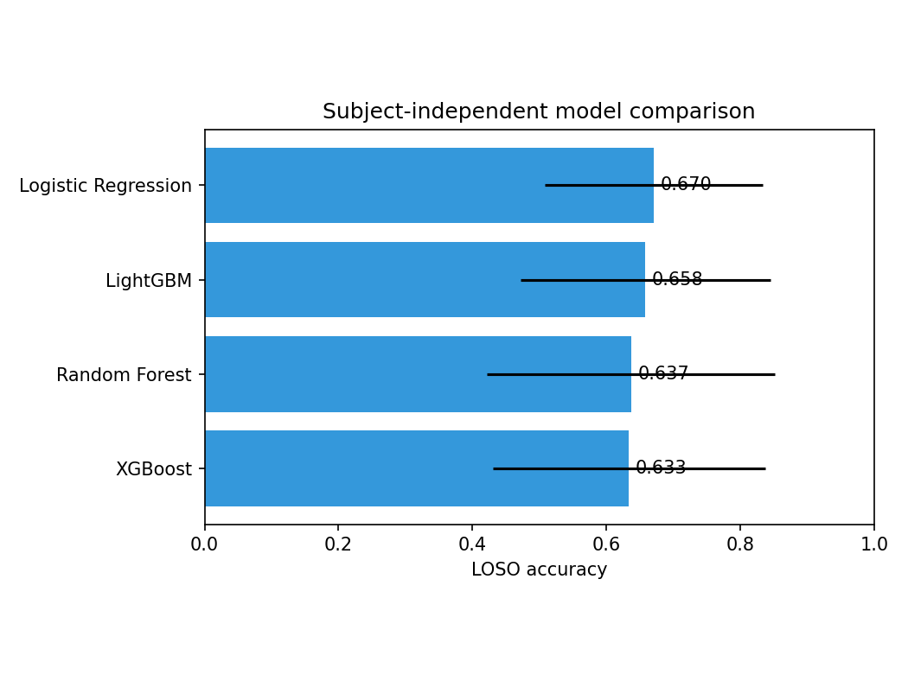
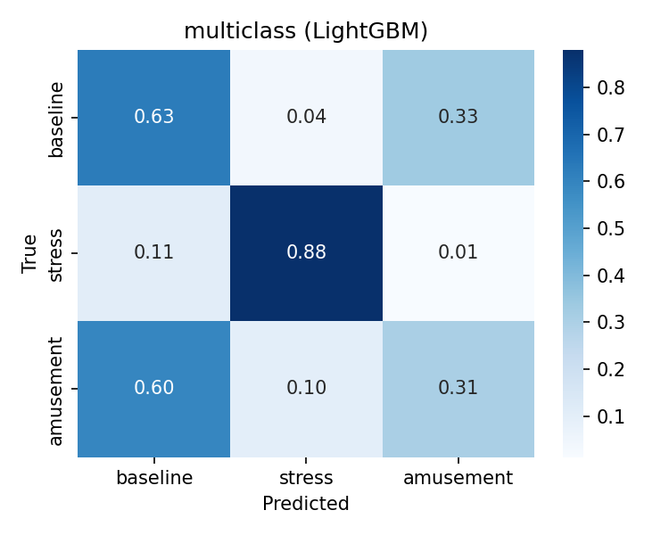

# The Accuracy You Read Is Not the Accuracy You Get: Four Layers of Optimism in Wearable Stress Detection

## Abstract

Wearable devices infer stress from physiological signals, and reported accuracy often exceeds 95%. Much of it is an evaluation artifact: pooling overlapping windows from all participants and splitting at random puts the same person in train and test, so the model recognizes the individual, not the stress. We re-evaluate the task subject-independent (Leave-One-Subject-Out) across four models and a convolutional network, and separate four sources of optimism. Subject leakage inflates accuracy by 6 points (binary) and 13 (three-class); the honest values are 0.91 and 0.66. Motion is not the cause, since dropping all movement features costs one point. A leakage-free model does not transfer, falling to near chance. Probabilities are miscalibrated on new people; leakage-free recalibration cuts calibration error from 0.070 to 0.025, and a 20-window enrollment does better without retraining. The four feature models are statistically tied. Subject-independent evaluation and calibrated confidence, not headline accuracy, are the right targets.

**Index Terms:** data leakage, electrodermal activity, heart rate variability, leave-one-subject-out, machine learning, personalization, physiological signals, probability calibration, stress detection, wearable computing.

## I. Introduction

Wearable sensors capture heart activity, skin conductance, temperature, and motion continuously, and stress-detection models on these signals report accuracy in the high nineties. The number depends on how they are scored. Physiological windows are autocorrelated, and pooling overlapping windows from every participant before a random split puts the same person in train and test [1], [2]. The model can then key on identity rather than stress, so the score measures memorization of known people, not generalization; one report reached 99.9% without separating subjects [3]. Models also fail across datasets, mostly by stressor type [4], [5]. And because an alert acts on a probability, calibration matters, yet it is rarely tested on unseen people.

We measure what survives subject-independent evaluation and where the inflation comes from, isolating four sources: subject leakage, motion, dataset shift, and miscalibration. We then restore trustworthy confidence with a leakage-free recalibration and a short per-subject enrollment, without retraining.

Contributions:

- A subject-independent benchmark of four models and a CNN, with the optimism gap measured on matched windows.
- An ablation separating autonomic signal from motion, and a cross-dataset transfer test.
- A leakage-free calibration analysis with per-subject personalization that needs no retraining.
- Open code and an in-browser demo.

Sections II to VI cover data, method, results, limitations, and conclusion.

## II. Data

We use two public, de-identified datasets (Table I). WESAD [6] has 15 subjects with chest (RespiBAN, 700 Hz) and wrist (Empatica E4) sensors, labeled baseline, stress, and amusement; we drop meditation as a recovery state, not a stressor contrast. PhysioNet Non-EEG [7] has 20 subjects with wrist signals and heart rate, used only for cross-dataset transfer.

**TABLE I. Datasets**

| Dataset | Subjects | Sensors | Role |
| --- | :-: | --- | --- |
| WESAD [6] | 15 | Chest RespiBAN 700 Hz; wrist E4 (BVP 64, EDA/TEMP 4, ACC 32 Hz) | Primary: baseline, stress, amusement |
| Non-EEG [7] | 20 | Wrist EDA/temperature/ACC, heart rate | Cross-dataset transfer (binary) |

## III. Method

### A. Signals and Features

Signals are filtered, R-peaks detected with ectopic correction, and the electrodermal signal split into tonic and phasic parts. We use 60 s windows at 50% overlap, kept only if at least 90% of samples share one in-set label. Extraction yields 58 features (Table II) and never sees labels.

**TABLE II. Feature groups (58 total)**

| Group | Count | Examples |
| --- | :-: | --- |
| HRV, time domain | 12 | MeanNN, SDNN, RMSSD, pNN50 |
| HRV, frequency | 8 | LF/HF power, LF/HF ratio |
| HRV, nonlinear | 10 | SampEn, DFA, SD1/SD2, CSI |
| Electrodermal | 15 | SCL level, SCR count, SCR amplitude |
| Temperature | 5 | mean, slope, range |
| Respiration | 3 | rate, amplitude, apnea index |
| Accelerometer | 5 | magnitude mean, std, energy |

### B. Models and Evaluation

Models: logistic regression, random forest, XGBoost, LightGBM, and a 1D-CNN on the raw window. Scoring is 15-fold LOSO, with imputation, scaling, and class balancing fit inside each fold. We report accuracy and macro-F1 (mean over subjects), bootstrap 95% CIs, and a Friedman test with Holm-corrected Wilcoxon. The optimism gap uses matched non-overlapping windows, so only the protocol changes. Table III lists the guard for each leak.

**TABLE III. Leakage sources and guards**

| Leak source | Guard |
| --- | --- |
| Scaler or imputer sees the test set | Fit inside each fold, on training data only |
| Same person in train and test | LOSO holds out a whole subject |
| Overlapping near-duplicate windows | Gap measured on non-overlapping windows |
| Recalibration sees the test subject | Calibrator fit on training subjects only |
| Enrollment overlaps evaluation | Enrollment drawn from a separate half |

### C. Calibration and Personalization

On pooled out-of-fold probabilities we report ECE, MCE (15 bins), and Brier [9] against a within-subject 5-fold baseline, and test the per-subject Brier gap (paired Wilcoxon, bootstrap CI). Recalibration is leakage-free: each fold's map is fit only on training subjects. Isotonic is pre-specified; sigmoid is a check. For personalization, a short enrollment (5, 10, or 20 windows) from a held-aside half fits a per-subject calibrator. A decision curve [10] reports net benefit against alert-all and alert-none.

## IV. Results

### A. Subject-Independent Benchmark

Random forest is nominally best on binary (0.913, 95% CI [0.860, 0.960]), but the four feature models are statistically tied (Friedman p = 0.81), so we report the family, not a winner (Table IV, Figs. 1-2). Three-class accuracy is far lower and close to majority, and amusement is the hardest class (Fig. 3).

**TABLE IV. Subject-independent (LOSO) performance**

| Model | Binary acc | Binary F1 | 3-class acc | 3-class F1 |
| --- | :-: | :-: | :-: | :-: |
| Logistic Regression | 0.902 | 0.883 | **0.670** | **0.613** |
| **Random Forest** | **0.913** | **0.898** | 0.637 | 0.535 |
| XGBoost | 0.903 | 0.873 | 0.633 | 0.552 |
| LightGBM | 0.894 | 0.860 | 0.658 | 0.568 |
| 1D-CNN | 0.718 | 0.648 | 0.626 | 0.543 |
| _Majority class_ | _0.647_ | n/a | _0.545_ | n/a |
| _Chance_ | _0.500_ | n/a | _0.333_ | n/a |

<table>
<tr>
<td align="center"> <em>Fig. 1. Binary accuracy by model, with error bars over subjects.</em></td>
<td align="center"> <em>Fig. 2. Three-class accuracy by model.</em></td>
</tr>
</table>

<table>
<tr>
<td align="center"></td>
<td align="center"></td>
</tr>
</table>

<em>Fig. 3. Confusion matrices, binary (left) and three-class (right).</em>

### B. Subject-Leakage Optimism Gap

Within-subject 5-fold on the same non-overlapping windows lifts binary accuracy from 0.907 to 0.964 and three-class from 0.658 to 0.792; only subject mixing changes (Table V). Random overlapping splits push it further toward 0.95 to 0.99 [1], [3]. Per-subject accuracy ranges widely (Fig. 4).

**TABLE V. Optimism gap (matched windows)**

| Task | Within-subject | LOSO | Gap |
| --- | :-: | :-: | :-: |
| Binary | 0.964 | 0.907 | +5.7 pts |
| 3-class | 0.792 | 0.658 | +13.3 pts |

 <em>Fig. 4. Per-subject LOSO accuracy; the line marks the mean.</em>

### C. Motion-Confound Ablation

Motion alone reaches 0.885, but removing all motion still gives 0.901: the signal is autonomic (Table VI, Fig. 5).

**TABLE VI. Feature-group ablation (binary, random forest)**

| Feature set | Accuracy |
| --- | :-: |
| All features (58) | 0.913 |
| **No motion** (53) | **0.901** |
| Autonomic, HRV and EDA (45) | 0.890 |
| EDA only (15) | 0.828 |
| HRV only (30) | 0.810 |
| Motion only (5) | 0.885 |

 <em>Fig. 5. Accuracy for feature subsets.</em>

### D. Wrist-Only Deployability

Wrist-only trails chest by 2 points (0.893 vs 0.913; best wrist 0.906), within noise at 15 subjects (Table VII, Fig. 6).

**TABLE VII. Wrist versus chest (binary)**

| Sensor | Model | Accuracy |
| --- | --- | :-: |
| Chest | Random Forest | 0.913 |
| Wrist | Random Forest | 0.893 |
| Wrist | XGBoost (best) | 0.906 |

 <em>Fig. 6. Chest and wrist accuracy.</em>

### E. Cross-Dataset Generalization

On a shared 18-feature binary space, within-dataset accuracy holds but transfer falls to near chance (Table VIII, Fig. 7). One confounded pair is illustrative only; a firm claim needs three matched corpora [2], [4], [5], [11].

**TABLE VIII. Cross-dataset transfer (balanced accuracy)**

| | Within-dataset | Cross-dataset |
| --- | :-: | :-: |
| WESAD | 0.86 | → Non-EEG: **0.57** |
| Non-EEG | 0.70 | → WESAD: **0.50** |

 <em>Fig. 7. Within-dataset accuracy holds; transfer collapses.</em>

### F. Interpretability

SHAP [12], computed on a model fit to all data and read as global importance, ranks motion, heart-rate level, skin-conductance responses, and respiration rate, all sensible for acute stress (Fig. 8).

 <em>Fig. 8. SHAP feature importance for the gradient-boosted model.</em>

### G. Calibration

LOSO is less calibrated than within-subject (per-subject Brier gap +0.066, paired Wilcoxon p < 0.001); leakage-free isotonic recalibration cuts ECE from 0.070 to 0.025 (Table IX, Fig. 9). The decision curve (Fig. 10) shows the cost of miscalibration, not an operating point.

**TABLE IX. Calibration of the binary random forest**

<!-- AUTOGEN:calibration START -->
| Evaluation | ECE | MCE | Brier |
| --- | :-: | :-: | :-: |
| Within-subject 5-fold | 0.085 | 0.290 | 0.077 |
| LOSO (subject-independent) | 0.070 | 0.160 | 0.136 |
| LOSO + leak-free recalibration | 0.025 | 0.271 | 0.129 |
<!-- AUTOGEN:calibration END -->

<table>
<tr>
<td align="center"> <em>Fig. 9. Reliability before and after recalibration.</em></td>
<td align="center"> <em>Fig. 10. Decision-curve net benefit across alert thresholds.</em></td>
</tr>
</table>

### H. Few-Shot Personalization

A per-subject calibrator beats a global one: ECE falls from 0.146 to 0.108 (global) to 0.069 (20 windows), passing global by about 10 windows, with no retraining (Table X, Fig. 11).

**TABLE X. Per-subject personalization (binary random forest)**

<!-- AUTOGEN:personalization START -->
| Recalibration | ECE | Brier |
| --- | :-: | :-: |
| None (LOSO) | 0.146 | 0.073 |
| Global (training subjects) | 0.108 | 0.074 |
| Few-shot, 5 windows | 0.097 | 0.061 |
| Few-shot, 10 windows | 0.071 | 0.059 |
| Few-shot, 20 windows | 0.069 | 0.058 |
<!-- AUTOGEN:personalization END -->

 <em>Fig. 11. Calibration error versus enrollment size.</em>

## V. Limitations and Future Work

- **Cohort.** 15 lab subjects give wide intervals and low power. Next: larger, free-living, multi-site cohorts, and a pre-registered study with multiplicity control.
- **Metrics.** Results use accuracy and F1 at a fixed threshold. Next: threshold-free AUROC and AUPRC, and a reported operating point.
- **Transfer.** One confounded pair cannot separate domain shift from stressor mismatch. Next: leave-one-dataset-out over at least three matched corpora.
- **Deep models.** A from-scratch CNN on this cohort is a weak baseline. Next: self-supervised pretraining and transfer.
- **Personalization.** Adaptation here recalibrates probabilities only. Next: personalize the feature space and threshold online, across tasks, sensors, and models.

## VI. Conclusion

Subject-independent evaluation deflates accuracy from the high nineties to 0.91 (binary) and 0.66 (three-class), and shows where the inflation comes from: subject leakage, a minor motion confound, lost transfer, and miscalibration on new people. Calibration is the layer usually omitted, and it has a cheap fix, since leakage-free recalibration and a short enrollment restore trustworthy confidence without retraining. Honest evaluation and calibrated confidence, not headline accuracy, should be the standard.

## References

[1] A. Bhanushali et al., "Stress Classification and Personalization: Getting the Most out of the Least," arXiv:2107.05666, 2021.

[2] G. Vos, K. Trinh, Z. Sarnyai, and M. Rahimi Azghadi, "Generalizable Machine Learning for Stress Monitoring from Wearable Devices: A Systematic Literature Review," Int. J. Medical Informatics, vol. 173, 105026, 2023.

[3] J. Oliver and S. Dakshit, "Cross-Modality Investigation on WESAD Stress Classification," arXiv:2502.18733, 2025.

[4] H. Benchekroun et al., "Cross Dataset Analysis for Generalizability of HRV-Based Stress Detection Models," Sensors, vol. 23, no. 4, 1807, 2023.

[5] P. Prajod, B. Mahesh, and E. André, "Stressor Type Matters! Exploring Factors Influencing Cross-Dataset Generalizability of Physiological Stress Detection," ICMI Companion, 2024.

[6] P. Schmidt, A. Reiss, R. Duerichen, C. Marberger, and K. Van Laerhoven, "Introducing WESAD, a Multimodal Dataset for Wearable Stress and Affect Detection," ICMI, 2018.

[7] J. Birjandtalab, D. Cogan, M. B. Pouyan, and M. Nourani, "A Non-EEG Dataset for Assessment of Neurological Status," IEEE BHI / PhysioNet, 2016.

[8] Task Force of the ESC and NASPE, "Heart Rate Variability: Standards of Measurement, Physiological Interpretation, and Clinical Use," Circulation, 1996.

[9] C. Guo, G. Pleiss, Y. Sun, and K. Q. Weinberger, "On Calibration of Modern Neural Networks," ICML, 2017.

[10] A. J. Vickers and E. B. Elkin, "Decision Curve Analysis: A Novel Method for Evaluating Prediction Models," Medical Decision Making, 2006.

[11] G. Vos et al., "Ensemble Machine Learning Model Trained on a New Synthesized Dataset Generalizes Well for Stress Prediction Using Wearable Devices," J. Biomedical Informatics, 2023.

[12] S. M. Lundberg and S.-I. Lee, "A Unified Approach to Interpreting Model Predictions," NeurIPS, 2017.
