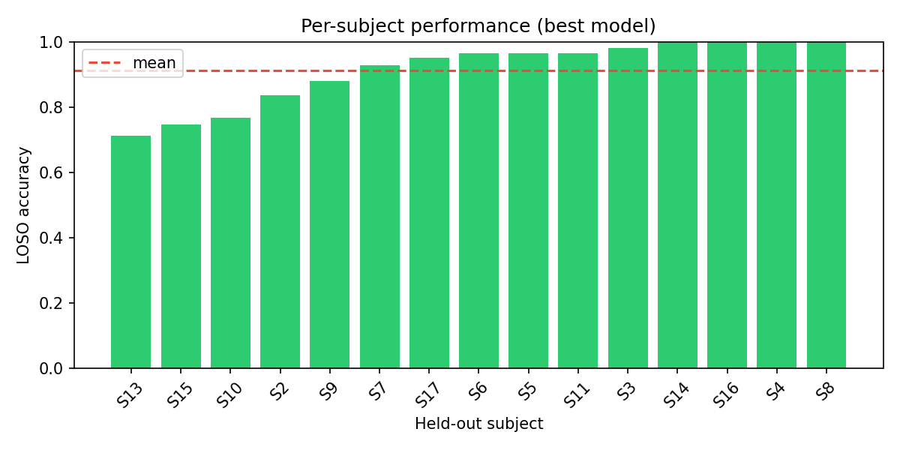
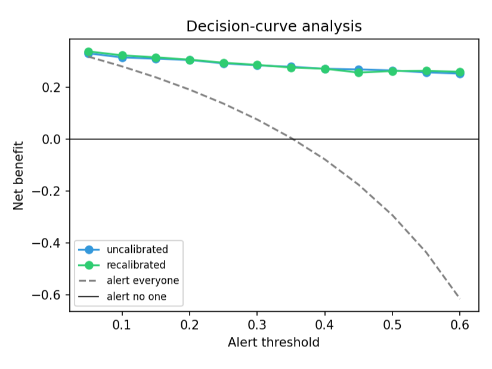

# Four Layers of Optimism in Wearable Stress Detection on WESAD: Subject Leakage, Motion, Dataset Shift, and Calibration

**Urme B** · [github.com/urme-b/CalmSense](https://github.com/urme-b/CalmSense)

## Abstract

Wearable stress-detection studies routinely report 95–99% accuracy on WESAD, but much of it comes
from evaluation that leaks information about the test set. This work measures how much performance
survives honest evaluation, peeling back four layers of optimism. **Subject leakage:** moving from
within-subject to Leave-One-Subject-Out (LOSO) cross-validation drops three-class accuracy from 0.79
to 0.66 and binary from 0.96 to 0.91; allowing overlapping windows inflates it further toward the
reported 0.95–0.99. **Motion confound:** an ablation shows accelerometer features alone reach 0.88,
yet removing motion entirely still gives 0.90, so the signal is autonomic, not just movement.
**Dataset shift:** a leakage-free model trained on WESAD falls to 0.50–0.57 balanced accuracy on a
second dataset (near chance). **Calibration:** accuracy is not the whole story for a model meant to
trigger alerts. Per subject, LOSO probabilities are significantly less calibrated than under
within-subject evaluation (Brier gap +0.066, paired Wilcoxon p < 0.001), and a leakage-free
recalibration cuts expected calibration error from 0.070 to 0.025. A **few-shot personalization** step —
a per-subject calibrator from a short labeled enrollment — improves further (ECE 0.146 → 0.069 at 20
windows), beating global recalibration without retraining.
A wrist-only model reaches 0.89, about two points behind the chest sensor, and the four feature-based
models are statistically indistinguishable (Friedman p = 0.81). The contribution
is a reproducible account of what subject-independent stress detection actually delivers — in accuracy
*and* in calibrated confidence — plus a simple personalization recipe to recover it. All results are on
15 lab subjects and should be read as preliminary; we make no real-world or clinical claim.

## 1. Background

WESAD (Schmidt et al., 2018) is the field's standard stress benchmark, and much published work reports
near-perfect accuracy on it. The dominant cause is subject-dependent validation: when overlapping
windows are pooled across participants and split randomly, autocorrelated windows from one recording
appear in both train and test, and the model learns person-specific signatures rather than stress
(Bhanushali et al., 2021; Vos et al., 2023). One study reported 99.9% with a random split that did not
separate subjects (Oliver & Dakshit, 2025). Models also degrade sharply across corpora, with stressor
type driving most of the drop (Benchekroun et al., 2023; Prajod et al., 2024). Under proper LOSO the
original WESAD authors reported roughly 93% binary and 80% three-class — the realistic reference points.
Almost all of this work reports accuracy or F1 alone; the *calibration* of the predicted probabilities,
which is what an alerting system actually thresholds, is rarely examined under subject-independent evaluation.

## 2. Data

**WESAD** (Schmidt et al., 2018): 15 subjects, chest RespiBAN (700 Hz) and wrist Empatica E4
(BVP 64 Hz, EDA/TEMP 4 Hz, ACC 32 Hz). We classify baseline, stress (TSST), and amusement. The fourth
WESAD condition, **meditation**, is excluded: it is a guided post-stressor recovery state rather than a
stressor contrast, and the original WESAD benchmark and most subsequent work report binary
(baseline/stress) and three-class (baseline/stress/amusement) results, so excluding meditation keeps
our numbers directly comparable to those baselines. **PhysioNet Non-EEG** (Birjandtalab et al., 2016):
20 subjects, wrist EDA/temperature/ACC and heart rate, used for cross-dataset transfer (psychological
stress vs. relaxation).

## 3. Method

Signals are filtered, R-peaks detected (NeuroKit2) with ectopic correction, and EDA decomposed into
tonic and phasic components. Recordings are segmented into 60-second windows at 50% overlap. A window
is kept only when at least 90% of its samples share one in-set condition; windows below that purity (or
whose dominant label is outside {baseline, stress, amusement}) are dropped, as is the trailing partial
window shorter than 60 s. Per-task window counts are recorded in `results/metrics.json` (`n_windows`).
The extractor emits 60 features; two respiration
features that need per-breath segmentation are always empty on this pipeline and dropped, leaving 58:
30 HRV (time/frequency/nonlinear; Task Force, 1996), 15 EDA, 5 temperature, 3 respiration, 5 motion.
Feature extraction never sees labels.

Models are logistic regression, random forest, XGBoost, LightGBM, and a compact 1D-CNN on raw windows.
All scoring is 15-fold LOSO; median imputation, standardization, and class balancing are fit inside
each fold. The headline benchmark uses fixed, sensible hyperparameters (not per-fold tuned); a separate
nested-CV analysis (`scripts/tuning.py`) selects hyperparameters with an inner grouped CV over training
subjects while the held-out subject stays untouched — so tuning cannot leak — and is reported as a
robustness check. We report
accuracy and macro-F1 (mean over subjects), bootstrap 95% CIs, a Friedman omnibus test with
Holm-corrected pairwise Wilcoxon tests, and a within-subject 5-fold baseline for the optimism gap. The
gap is measured on a matched set of non-overlapping windows: LOSO is recomputed on the same windows the
within-subject baseline uses, so only the validation scheme differs, not the sample size.

For calibration we pool the out-of-fold LOSO probabilities and report expected and maximum calibration
error (ECE, MCE; 15 confidence bins) and the Brier score (Guo et al., 2017), against the same
within-subject 5-fold baseline. The optimism gap is tested for significance on per-subject Brier scores
(paired Wilcoxon across the 15 subjects, with a bootstrap 95% CI on the mean gap). Recalibration is
leakage-free: inside each LOSO fold a calibration map is fit only on out-of-fold probabilities of the
*training* subjects, then applied to the held-out subject. **Isotonic regression is the pre-specified
primary map**; a sigmoid (Platt) map is reported only as a robustness check, because isotonic can be
unstable on the small per-fold calibration sets. The choice was fixed before inspecting test-fold
calibration, not selected to maximise the reported improvement. We also
test **few-shot personalization**: each subject keeps a fixed evaluation half, and a small labeled
enrollment (5/10/20 windows) drawn from the other half fits a per-subject calibrator — never the
evaluation windows. We close with a decision-curve analysis (Vickers & Elkin, 2006): net benefit
across alert thresholds for the uncalibrated and recalibrated models versus the alert-everyone and
alert-no-one policies.

## 4. Results

### 4.1 Subject-independent benchmark

| Model               | Binary acc | Binary F1 | 3-class acc | 3-class F1 |
| ------------------- | :--------: | :-------: | :---------: | :--------: |
| Logistic Regression | 0.902      | 0.883     | **0.670**   | **0.613**  |
| **Random Forest**   | **0.913**  | **0.898** | 0.637       | 0.535      |
| XGBoost             | 0.903      | 0.873     | 0.633       | 0.552      |
| LightGBM            | 0.894      | 0.860     | 0.658       | 0.568      |
| 1D-CNN              | 0.718      | 0.648     | 0.626       | 0.543      |
| _Majority class_    | _0.647_    | —         | _0.545_     | —          |
| _Chance_            | _0.500_    | —         | _0.333_     | —          |

Context: the binary task is imbalanced (562 baseline / 307 stress windows; 64.7% majority), and the
three-class task is 562 / 307 / 163 (54.5% majority). So the 0.913 binary result is ~27 points above the
majority-class baseline and the 0.67 three-class result ~13 points above it — both well clear of chance,
but the three-class margin is modest. Random Forest is nominally best on binary (0.913, 95% CI
[0.860, 0.960]), but the four feature models are statistically indistinguishable (Friedman p = 0.81; no
significant Holm-corrected pair), so we report the family rather than a winner. All beat the from-scratch
1D-CNN, which underperforms at this data scale. Three-class accuracy is far lower (0.63–0.67), matching
the original WESAD LOSO results.

### 4.2 Subject-leakage optimism gap

For the best model per task, replacing LOSO with within-subject 5-fold (non-overlapping windows,
pooled identically, so only subject mixing changes) raises binary accuracy from 0.907 to 0.964
(+5.7 pts) and three-class from 0.658 to 0.792 (+13.3 pts). Both bars use the same non-overlapping
windows (every other window per subject), so the gap reflects subject mixing, not near-duplicate
overlapping windows. This is conservative: in prior work, *additionally* splitting overlapping windows
at random pushes the within-subject figure toward the reported 0.95–0.99 (Bhanushali et al., 2021;
Oliver & Dakshit, 2025) — we cite that as the mechanism rather than reproducing the inflated setting.

Per-subject LOSO accuracy varies widely — the headline mean hides subjects the model handles poorly
(binary 0.71–1.00; three-class 0.43–0.96), which is why every subject-level statistic carries wide
intervals (§5).

| Subject | Binary acc | 3-class acc |
| --- | :-: | :-: |
| S2 | 0.84 | 0.59 |
| S3 | 0.98 | 0.67 |
| S4 | 1.00 | 0.84 |
| S5 | 0.97 | 0.43 |
| S6 | 0.96 | 0.87 |
| S7 | 0.93 | 0.44 |
| S8 | 1.00 | 0.72 |
| S9 | 0.88 | 0.56 |
| S10 | 0.77 | 0.51 |
| S11 | 0.97 | 0.96 |
| S13 | 0.71 | 0.73 |
| S14 | 1.00 | 0.90 |
| S15 | 0.75 | 0.61 |
| S16 | 1.00 | 0.59 |
| S17 | 0.95 | 0.64 |
| **Mean** | **0.91** | **0.67** |



### 4.3 Motion-confound ablation

| Feature set                       | Binary acc (RF) |
| --------------------------------- | :-------------: |
| All features (58)                 | 0.913           |
| **No motion** (HRV+EDA+TEMP+RESP, 53) | **0.901**   |
| Autonomic (HRV+EDA, 45)           | 0.890           |
| EDA only (15)                     | 0.828           |
| HRV only (30)                     | 0.810           |
| Motion only (ACC, 5)              | 0.885           |

Motion alone reaches 0.885, plausibly because the stress task involves more movement than the seated
baseline. But removing motion entirely still gives 0.901, within 1.2 points of the full model: stress
is detectable from autonomic physiology alone.

### 4.4 Wrist-only deployability

Using only Empatica E4 wrist signals, a random forest reaches 0.893 versus 0.913 for the chest — a
2.0-point drop, within CI noise at N = 15. The best wrist model (XGBoost, 0.906) is within 0.7 points
of the best chest model. A research-grade chest strap is not required.

### 4.5 Cross-dataset generalization

|         | Within-dataset (bal. acc) | Cross-dataset (bal. acc) |
| ------- | :-----------------------: | :----------------------: |
| WESAD   | 0.86                      | → Non-EEG: **0.57**      |
| Non-EEG | 0.70                      | → WESAD: **0.50**        |

Both datasets are harmonized to a **binary stress vs. non-stress** contrast on an 18-feature
device-agnostic space, which partly controls for label *granularity* (we are not asking a 3-class model
to transfer). Within-dataset accuracy is healthy but cross-dataset transfer collapses to near chance.
This remains a single, confounded transfer pair: even at binary granularity the drop still mixes domain
shift with differing stressor *constructs* (TSST vs. cognitive/emotional stress) and a reduced feature
space, and one pair cannot separate these causes. We therefore read it as illustrative, not as
evidence of a specific domain-shift magnitude — a robust claim needs ≥3 corpora with matched stress
constructs (Vos et al., 2023; Benchekroun et al., 2023; Prajod et al., 2024). Within-dataset success
does not imply generalization.

### 4.6 Interpretability

SHAP values (Lundberg & Lee, 2017) rank a motion descriptor (`ACC_zero_crossings`) first, then
heart-rate level (`HRV_MedianNN`, `HRV_MeanNN`), skin-conductance responses, and respiration rate —
physiologically sensible for acute stress, and the motivation for the §4.3 ablation.

### 4.7 Calibration: a fourth layer of optimism

Accuracy says nothing about whether a predicted probability of 0.8 means roughly 80% of such windows
are truly stress — yet that calibrated confidence is what an alerting system acts on. We measure it on
the pooled out-of-fold probabilities of the binary random forest. The optimism is clearest in the
**Brier score**: per subject, LOSO is significantly less calibrated than the within-subject 5-fold
baseline (mean Brier gap **+0.066**, 95% CI [0.035, 0.106], paired Wilcoxon **p < 0.001**, on matched
non-overlapping windows). Pooled ECE tells a softer story — within-subject 0.085 vs LOSO 0.070 — so the
effect is a per-subject Brier phenomenon rather than a large pooled-ECE gap, which is why we rest the
claim on the significance test, not a single pooled number. A leakage-free isotonic recalibration, fit
only on out-of-fold *training*-subject probabilities and never touching the held-out subject, cuts LOSO
ECE from **0.070 to 0.025** (sigmoid: 0.035, the robustness check).

<!-- AUTOGEN:calibration START -->
| Evaluation | ECE | MCE | Brier |
| --- | :-: | :-: | :-: |
| Within-subject 5-fold | 0.085 | 0.290 | 0.077 |
| LOSO (subject-independent) | 0.070 | 0.160 | 0.136 |
| LOSO + leak-free recalibration | 0.025 | 0.271 | 0.129 |
<!-- AUTOGEN:calibration END -->


A decision-curve analysis illustrates why calibration matters for any thresholded use: we compare net
benefit across alert thresholds for the uncalibrated versus recalibrated LOSO model. This is a
methodological illustration on lab data, not a clinical claim — WESAD is acute induced stress in 15
people, so the curve shows the *shape* of the cost of miscalibration, not a deployable operating point.



### 4.8 Few-shot personalization

Global recalibration cannot adapt to a person it never saw. We test whether a per-subject calibrator
can: each subject keeps a fixed evaluation half, with a short labeled enrollment (5/10/20 windows)
drawn only from non-overlapping windows in the other half, so enrollment never overlaps the evaluation
set. It works: ECE falls from **0.146** (uncalibrated) to **0.108** with global recalibration and to
**0.069** with a 20-window few-shot calibrator — improving monotonically with enrollment size and
overtaking global recalibration within ~10 windows. This turns the calibration diagnosis into a cheap
per-subject fix that needs no retraining of the base model.

<!-- AUTOGEN:personalization START -->
| Recalibration | ECE | Brier |
| --- | :-: | :-: |
| None (LOSO) | 0.146 | 0.073 |
| Global (training subjects) | 0.108 | 0.074 |
| Few-shot, 5 windows | 0.097 | 0.061 |
| Few-shot, 10 windows | 0.071 | 0.059 |
| Few-shot, 20 windows | 0.069 | 0.058 |
<!-- AUTOGEN:personalization END -->

## 5. Limitations

- **Sample size.** 15 subjects and lab-induced (TSST) stress; per-subject accuracy ranges 0.71–1.00.
  Every subject-level statistic (optimism gaps, calibration gap, personalization curve) rests on 15
  points, so confidence intervals are wide and tests are low-powered. All findings are preliminary and
  carry no claim to real-world or chronic stress.
- **Multiplicity.** Only the primary model comparison is multiplicity-controlled (Friedman +
  Holm-corrected Wilcoxon). The ablation, wrist-vs-chest, cross-dataset, calibration, and
  personalization analyses are exploratory and **not** corrected for multiple comparisons; with N=15,
  the small effects there (e.g. the 0.7–2.0-pt wrist gap) are within noise and should be read as
  descriptive, not as significant findings.
- **Short-window HRV.** Frequency-domain HRV (LF/HF) is estimated on 60-second windows; the LF band
  (0.04–0.15 Hz) spans only ~2–9 cycles per window, so those features are noisier and less standardized
  than the ≥2-minute segments the Task Force (1996) guidance assumes. They are used as relative
  features within a consistent pipeline, not as clinical HRV measurements.
- **Cross-dataset.** A single confounded transfer pair cannot separate domain shift from stressor-type
  mismatch even at binary granularity; a robust leave-one-dataset-out claim needs ≥3 corpora with
  matched stress constructs.
- **Deep model.** A from-scratch 1D-CNN on 15 subjects is not a fair test of deep learning (no
  pretraining or transfer); it is a small-scale baseline only — no verdict on deep methods is implied.
- **Calibration scope.** Calibration, decision-curve, and personalization numbers are binary, chest,
  random forest; isotonic recalibration can be unstable on small folds, so a sigmoid map is the check.

## 6. Reproducibility

```bash
pip install -e .
make demo                 # full pipeline on synthetic data, no download (runs offline from a clone)
make data                 # PhysioNet Non-EEG for cross-dataset transfer (WESAD: see data/raw/README.md)
make reproduce            # regenerates every WESAD number and figure — requires the WESAD download
```

All randomness is seeded. The headline WESAD results in `results/` are a committed snapshot; a clean
clone reproduces the full pipeline only on synthetic data via `make demo` (also the one-click Colab
notebook and CI path), since WESAD is not redistributed. WESAD and PhysioNet Non-EEG are public and
downloaded separately.

## Ethics

Both datasets are public, de-identified, and consented. Physiological stress inference is sensitive and
should support, not surveil; honest evaluation is itself an ethical requirement, since a model validated
only within-subject or within-dataset overstates its reliability for the people it is meant to help.

## References

- Schmidt, Reiss, Duerichen, Marberger, Van Laerhoven. *Introducing WESAD, a Multimodal Dataset for
  Wearable Stress and Affect Detection.* ICMI 2018.
- Birjandtalab, Cogan, Pouyan, Nourani. *A Non-EEG Dataset for Assessment of Neurological Status.*
  IEEE BHI / PhysioNet, 2016.
- Bhanushali et al. *Stress Classification and Personalization: Getting the Most out of the Least.*
  arXiv:2107.05666, 2021.
- Vos, Trinh, Sarnyai, Rahimi Azghadi. *Generalizable Machine Learning for Stress Monitoring from
  Wearable Devices: A Systematic Literature Review.* Int. J. Medical Informatics 173:105026, 2023
  (arXiv:2209.15137).
- Vos et al. *Ensemble Machine Learning Model Trained on a New Synthesized Dataset Generalizes Well for
  Stress Prediction Using Wearable Devices.* J. Biomedical Informatics, 2023 (arXiv:2209.15146).
- Benchekroun et al. *Cross Dataset Analysis for Generalizability of HRV-Based Stress Detection Models.*
  Sensors 23(4):1807, 2023.
- Prajod, Mahesh, André. *Stressor Type Matters! Exploring Factors Influencing Cross-Dataset
  Generalizability of Physiological Stress Detection.* ICMI Companion 2024 (arXiv:2405.09563).
- Oliver, Dakshit. *Cross-Modality Investigation on WESAD Stress Classification.* arXiv:2502.18733, 2025.
- Task Force of the ESC/NASPE. *Heart Rate Variability: Standards of Measurement, Physiological
  Interpretation, and Clinical Use.* Circulation, 1996.
- Lundberg, Lee. *A Unified Approach to Interpreting Model Predictions.* NeurIPS 2017.
- Guo, Pleiss, Sun, Weinberger. *On Calibration of Modern Neural Networks.* ICML 2017.
- Vickers, Elkin. *Decision Curve Analysis: A Novel Method for Evaluating Prediction Models.*
  Medical Decision Making, 2006.
