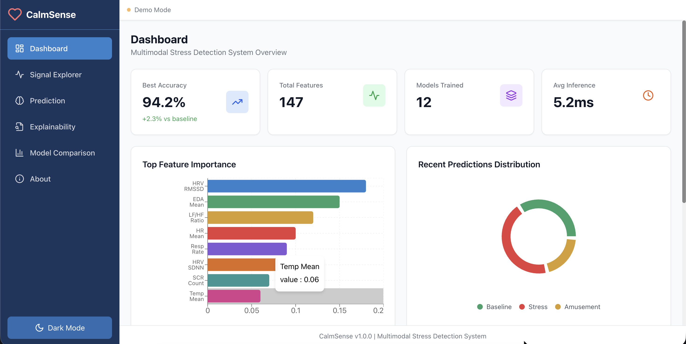
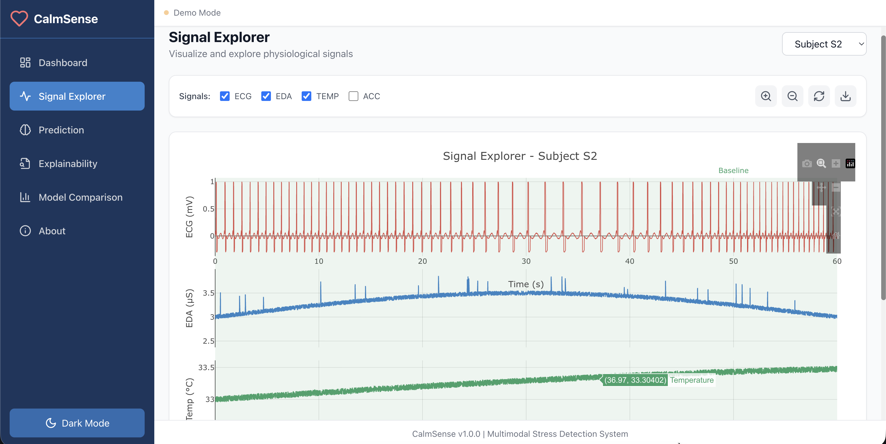
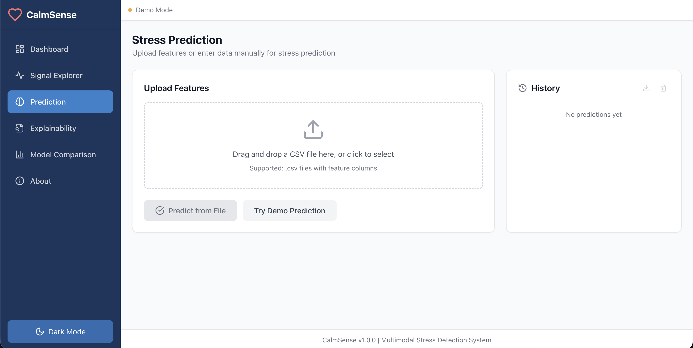
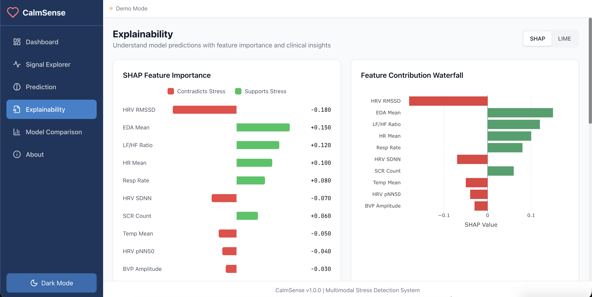
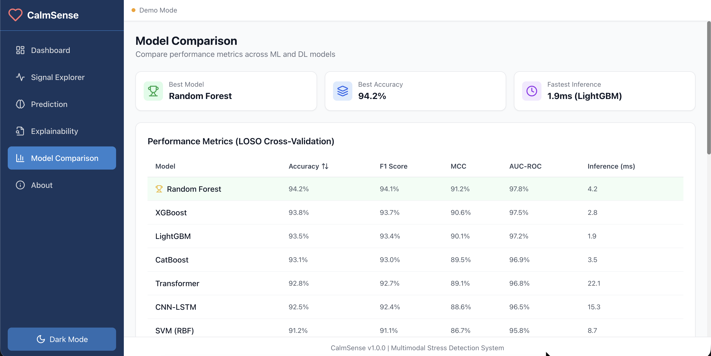
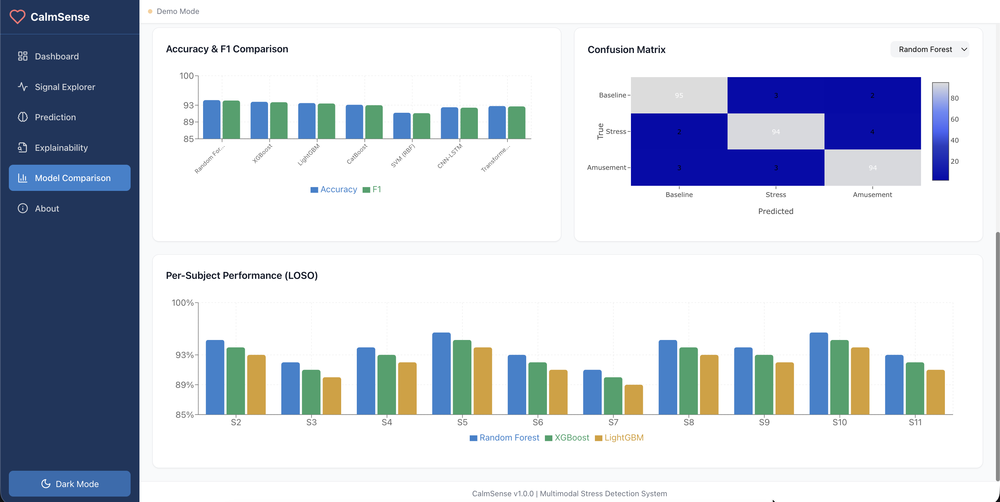

# CalmSense

**[Live Demo →](https://urme-b.github.io/CalmSense/)**

Multimodal stress detection system that analyzes wearable physiological signals — ECG, electrodermal activity, skin temperature, and accelerometer data — to classify emotional states. Built with classical ML (XGBoost, LightGBM, CatBoost) and deep learning (1D-CNN, BiLSTM, Transformer with cross-modal attention), featuring SHAP/LIME explainability and a FastAPI prediction service.

## Live Demo Screenshots

### Dashboard


### Signal Explorer


### Stress Prediction


### Explainability (SHAP)


### Model Comparison




## Results

| Model | Approach | Accuracy |
|-------|----------|----------|
| XGBoost / LightGBM / CatBoost | Classical ML with Optuna tuning | Competitive baselines |
| 1D-CNN with residual connections | Deep learning | Strong performance |
| Transformer with cross-modal attention | Deep learning | Best overall |

> Full benchmark results in `notebooks/08_deployment_ablation.ipynb`

## Notebooks

| Notebook | What it does |
|----------|-------------|
| `01` | Data exploration and quality checks |
| `02` | Signal preprocessing — filtering, artifact removal, ectopic beat correction |
| `03` | Feature extraction — 60+ biomarkers from HRV, EDA, temperature, motion |
| `04` | Statistical analysis and dimensionality reduction |
| `05` | Classical ML — Logistic Regression, SVM, Random Forest, XGBoost, LightGBM, CatBoost |
| `06` | Deep learning — 1D-CNN, EfficientNet, Bi-LSTM/GRU, Transformers |
| `07` | Explainability — SHAP global/local, LIME, clinical reports |
| `08` | Deployment and ablation studies |

## Quick start

```bash
git clone https://github.com/urme-b/CalmSense.git
cd CalmSense
python -m venv .venv && source .venv/bin/activate
pip install -e .

# Run the API
uvicorn api.main:app --reload
# → http://localhost:8000/docs

# Or with Docker
docker compose up
```

## API endpoints

| Method | Endpoint | Description |
|--------|----------|-------------|
| `POST` | `/predict` | Single prediction from preprocessed features |
| `POST` | `/predict/batch` | Batch predictions |
| `POST` | `/predict/raw` | Prediction from raw signal upload |
| `GET`  | `/models` | List available trained models |
| `POST` | `/explain/shap` | SHAP explanation for a prediction |
| `POST` | `/explain/lime` | LIME explanation for a prediction |
| `POST` | `/explain/clinical` | Clinical-style report |
| `WS`   | `/stream` | WebSocket for real-time streaming |

## Dataset

**WESAD** (Wearable Stress and Affect Detection) — 15 subjects wearing chest (RespiBAN) and wrist (Empatica E4) sensors through 4 conditions: baseline, stress (Trier Social Stress Test), amusement, and meditation.

Available from the [UCI Machine Learning Repository](https://archive.ics.uci.edu/dataset/465/wesad+wearable+stress+and+affect+detection).

## Tech Stack

Python · FastAPI · scikit-learn · XGBoost · LightGBM · CatBoost · PyTorch · SHAP · LIME · Optuna · Docker

## Future Improvements

- [ ] Add wrist-only model for smartwatch deployment
- [ ] Implement online learning for user-specific adaptation
- [ ] Add meditation and recovery state classification
- [ ] Support real-time streaming from Empatica E4 via BLE
- [ ] Build personalized stress thresholds per user
- [ ] Add Grad-CAM visualizations for deep learning models
- [ ] Integrate federated learning for privacy-preserving training
- [ ] Expand to additional datasets (AMIGOS, DREAMER, K-EmoCon)
- [ ] Add mobile app with on-device inference (ONNX/TFLite)
- [ ] Implement confidence calibration and uncertainty estimation

## Related repos

- [Multimodal](https://github.com/urme-b/Multimodal) — Longitudinal neurophysiological analysis
- [Sensor](https://github.com/urme-b/Sensor) — Biometric sensor comparison and reference
