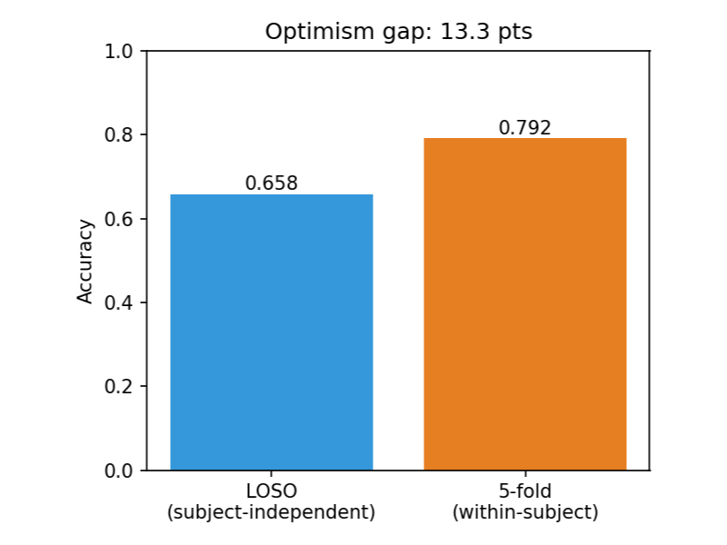

# CalmSense

Honest, leakage-free stress detection from wearable physiology — and an accounting of the **three
layers of optimism** that inflate published WESAD numbers.

Most WESAD papers report 95%+ accuracy, but much of it is an artefact of how it's measured. CalmSense
strips that away layer by layer: it evaluates everything with strict **Leave-One-Subject-Out (LOSO)**
cross-validation, shows the result isn't a **motion confound**, proves it works on a **wrist-only**
consumer device — and then shows that even an honest within-dataset model **does not transfer to a
second dataset**.

**[Live demo →](https://urme-b.github.io/CalmSense/)**

## Results (Leave-One-Subject-Out, 15 subjects)

**Binary — stress vs. non-stress** (869 windows)

| Model | LOSO Accuracy | Macro-F1 |
|-------|:-------------:|:--------:|
| **Random Forest** | **0.913 ± 0.101** | **0.898** |
| XGBoost | 0.903 | 0.873 |
| Logistic Regression | 0.902 | 0.883 |
| LightGBM | 0.894 | 0.860 |
| 1D-CNN (raw signals) | 0.718 | 0.648 |

**Three-class — baseline / stress / amusement** (1032 windows)

| Model | LOSO Accuracy | Macro-F1 |
|-------|:-------------:|:--------:|
| **Logistic Regression** | **0.670** | **0.613** |
| LightGBM | 0.658 | 0.568 |
| Random Forest | 0.637 | 0.535 |
| XGBoost | 0.633 | 0.552 |
| 1D-CNN (raw signals) | 0.626 | 0.543 |

Random Forest is nominally the top binary model (95% CI [0.860, 0.960]), but the four feature models
are **statistically indistinguishable** (Friedman omnibus p=0.81; no significant Holm-corrected pairwise
difference), so we report the family rather than crown a winner. The same holds on the three-class task.

### The three layers of optimism

**1. Subject leakage.** For the best model on each task, switching from LOSO to within-subject 5-fold
(on non-overlapping windows, pooled the same way) inflates accuracy from **0.913 → 0.964** (binary) and
**0.671 → 0.792** (three-class, a 12-point gap). Allowing the overlapping windows many papers split at
random inflates the within-subject figure further toward the 0.95–0.99 commonly reported.

**2. Motion confound.** Accelerometer features alone reach 0.885 (the stress task involves more
movement than baseline) — but **removing motion entirely still gives 0.901 vs 0.913**, so physiology
alone suffices, even though motion is independently informative.

**3. Dataset shift.** Even leakage-free LOSO doesn't transfer: trained on WESAD, tested on the
PhysioNet Non-EEG dataset (and vice versa) on a shared feature space, balanced accuracy **collapses to
0.50–0.57 — near chance.** (Different stressors, devices, and label schemes contribute alongside true
domain shift.) Within-dataset success is not real-world generalization.

And a practical win — **wrist-only works**: with the same model (random forest), Empatica E4 wrist
signals reach **0.893 vs 0.913** for the chest — a ~2-point drop, no chest strap needed.

| Optimism gap (3-class) | Feature ablation | Cross-dataset collapse | Chest vs wrist |
|---|---|---|---|
|  |  |  |  |

Full methodology, results, and citations in [`PAPER.md`](PAPER.md). Every number and figure is
regenerated by the scripts below.

## How it works

```
raw WESAD signals  →  filtering + R-peak/EDA processing  →  60s windows (50% overlap)
   →  58 HRV / EDA / temperature / respiration / motion features
   →  leakage-free LOSO benchmark (impute + scale fit per fold)
   →  metrics, confusion matrices, per-subject scores, SHAP, optimism gap
```

- **Signals (chest, 700 Hz):** ECG, electrodermal activity, temperature, respiration, accelerometer.
- **Features:** HRV time/frequency/nonlinear (Task Force 1996), EDA tonic/phasic + SCR, temperature,
  respiration, and motion descriptors.
- **No leakage:** subjects never cross the train/test boundary; imputation and scaling are fit on the
  training fold only; class imbalance is handled with balanced weights inside each fold.

The most informative biomarkers (mean |SHAP|) lead with a motion descriptor (`ACC_zero_crossings`),
then heart-rate level (`HRV_MedianNN`, `HRV_MeanNN`), skin-conductance responses (`EDA_SCR_*`), and
respiration rate — consistent with the physiology of acute stress (and the reason for the motion
ablation above).

## Quick start

```bash
git clone https://github.com/urme-b/CalmSense.git
cd CalmSense
python -m venv .venv && source .venv/bin/activate
pip install -e .
# macOS only, for xgboost/lightgbm: brew install libomp

# Download WESAD into data/raw/WESAD first (see data/raw/README.md), then:
python scripts/run_experiment.py       # LOSO benchmark, optimism gap, SHAP, trained model
python scripts/ablation.py             # motion-confound ablation
python scripts/wrist.py                # wrist-only (Empatica E4) model
python scripts/cross_dataset.py        # WESAD <-> PhysioNet Non-EEG transfer
python scripts/stats.py                # Friedman + Holm-corrected tests, 95% CIs
python scripts/export_onnx.py          # export model for the in-browser dashboard
python scripts/build_dashboard_data.py # refresh the dashboard's results.json
#   → results/*.json, results/*.csv, outputs/figures/*.png

# Serve the trained model
uvicorn api.main:app --reload        # http://localhost:8000/docs
```

`run_experiment.py` caches the windowed features, so re-runs and the analysis scripts are fast. Use
`--no-cnn` to skip the deep model, or `--subjects S2 S3` for a quick subset.

## API

| Method | Endpoint | Description |
|--------|----------|-------------|
| `POST` | `/predict` | Stress prediction + class probabilities from a feature vector |
| `POST` | `/explain` | Prediction plus top SHAP feature contributions |
| `GET`  | `/model`   | Model classes and expected feature names |
| `GET`  | `/health`  | Liveness and whether a model is loaded |

```bash
curl -X POST localhost:8000/predict -H 'Content-Type: application/json' \
  -d '{"features": {"HRV_MeanNN": 650, "HRV_RMSSD": 18, "EDA_SCL_mean": 6.0}}'
```

## Project layout

```
src/preprocessing/   ECG / EDA / respiration filtering, R-peak detection, windowing
src/features/        HRV, EDA, temperature, respiration, accelerometer extractors
src/dataset.py       windows raw signals → feature matrix + raw CNN tensors (cached)
src/models/ml/       classical classifiers (LR, RF, XGBoost, LightGBM)
src/models/dl/       residual 1D-CNN
src/portable.py      shared feature space for cross-dataset transfer
scripts/             run_experiment, ablation, wrist, cross_dataset, stats, export_onnx
api/                 FastAPI prediction service
frontend/            React dashboard (runs the model in-browser via ONNX)
```

## Dataset

**WESAD** (Schmidt et al., ICMI 2018) — 15 subjects, chest (RespiBAN) + wrist (Empatica E4) sensors,
four conditions (baseline, TSST stress, amusement, meditation). Download from the
[UCI repository](https://archive.ics.uci.edu/dataset/465/wesad+wearable+stress+and+affect+detection)
into `data/raw/WESAD/` — see [`data/raw/README.md`](data/raw/README.md). The dataset is not redistributed here.

## Notes and limitations

- 15 subjects is small; LOSO accuracy varies from 0.71 to 1.00 across held-out subjects (see
  `outputs/figures/binary_per_subject.png`). Means are reported with across-subject standard deviation.
- WESAD captures acute, lab-induced stress; this does not establish generalisation to real-world or
  chronic stress.
- The chest ECG gives cleaner HRV than a wrist device; the wrist-only model is more deployable and,
  here, only ~2 points behind the chest.

The methodology and full discussion are in [`PAPER.md`](PAPER.md).

## Tech stack

Python · scikit-learn · XGBoost · LightGBM · PyTorch · SHAP · NeuroKit2 · FastAPI · React · Docker

## License

MIT — see [LICENSE](LICENSE). If you use this work, please cite via [`CITATION.cff`](CITATION.cff).
