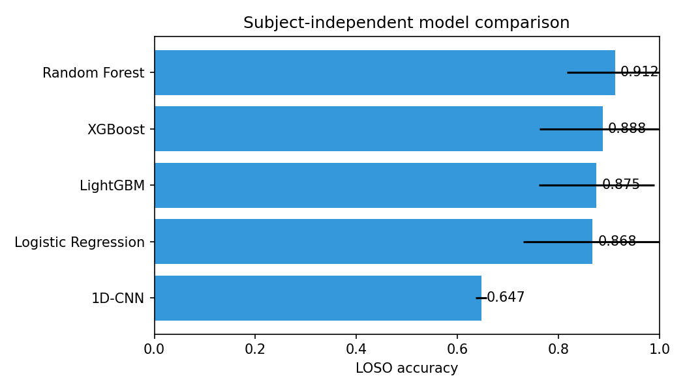
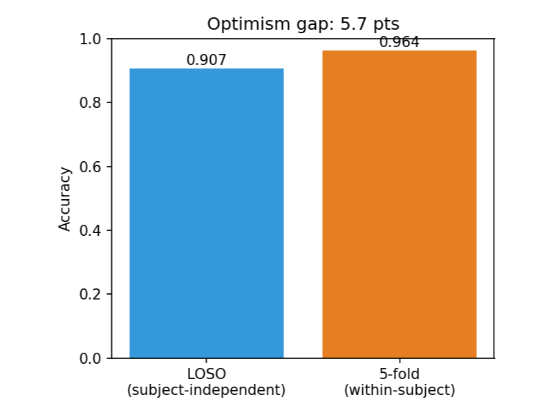
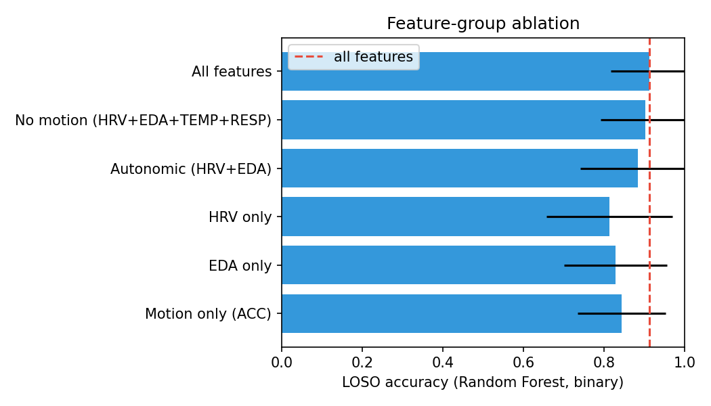
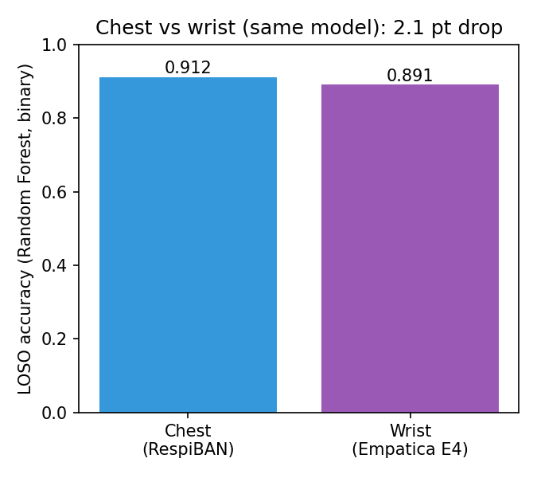
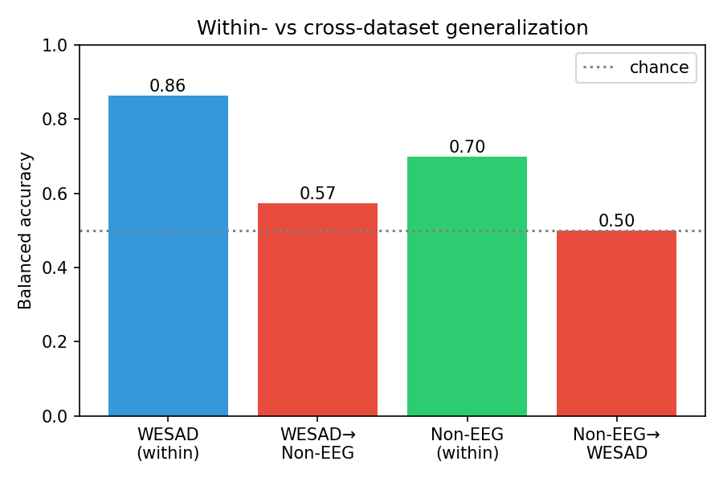
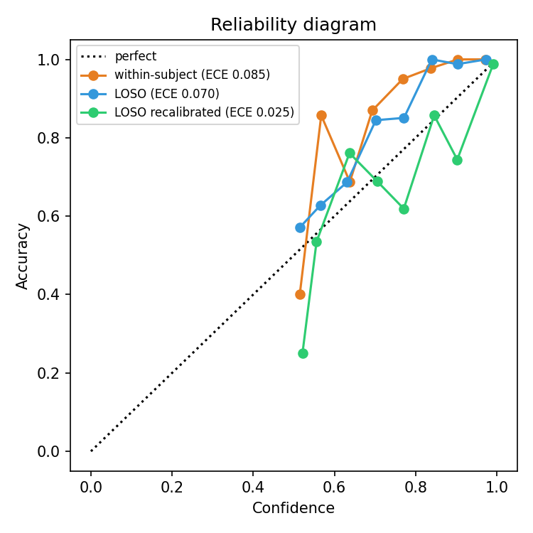
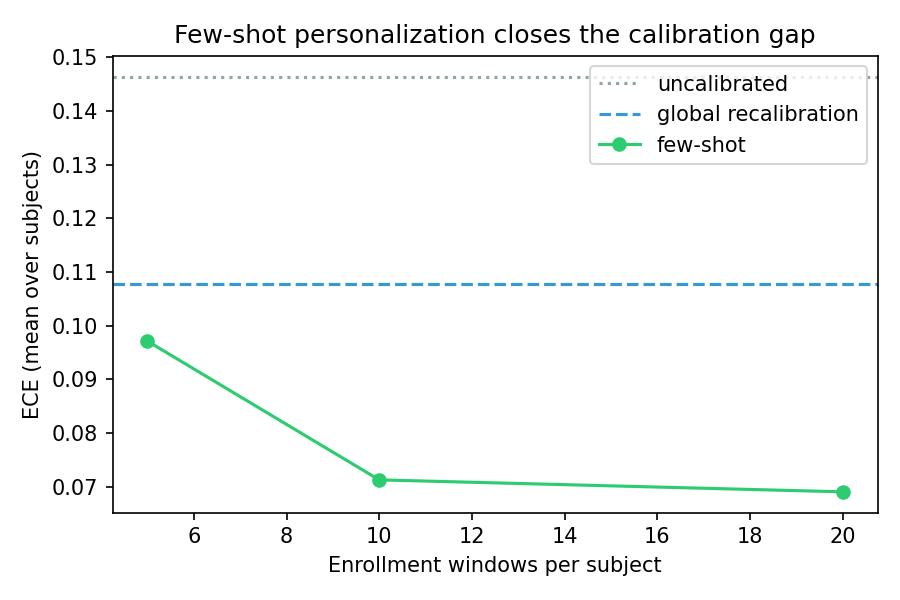
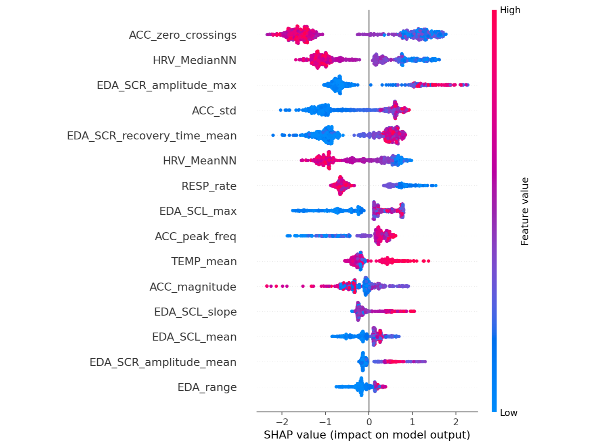
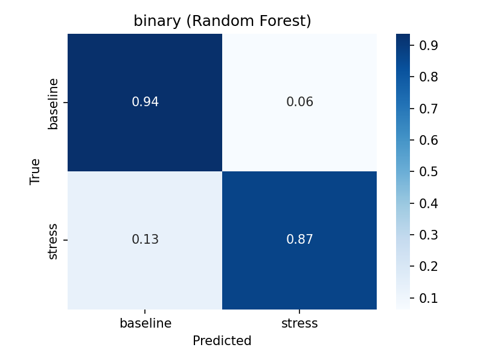

# CalmSense

> Wearable stress detection scored on people it has never seen, so the accuracy you read is the accuracy you get.

[Live demo](https://urme-b.github.io/CalmSense/) · [Colab](https://colab.research.google.com/github/urme-b/CalmSense/blob/main/notebooks/CalmSense.ipynb) · [Paper](PAPER.md)

## What this is

- Detects `stress` vs `baseline` from wearable signals: ECG, EDA (skin conductance), temperature, respiration, motion.
- Scored Leave-One-Subject-Out (LOSO): train on 14 people, test on the 15th, rotate.
- Shows where the usual high numbers come from: subject leakage, motion, dataset shift, calibration.
- Runs in the browser (ONNX, no backend). `make demo` runs the full pipeline offline on synthetic signals.

## Results

Binary (`baseline` vs `stress`), 15 subjects, LOSO, mean over held-out subjects.

| Model | Accuracy | F1 (macro) |
|---|---|---|
| Random Forest | 0.913 | 0.898 |
| XGBoost | 0.903 | 0.873 |
| Logistic Regression | 0.902 | 0.883 |
| LightGBM | 0.894 | 0.860 |
| 1D-CNN (raw signal) | 0.718 | 0.648 |

- The 4 feature models are a statistical tie (Friedman p = 0.81). RF 95% CI: [0.860, 0.960].

Key findings, one per check:

| Check | Question | Result |
|---|---|---|
| Subject leakage | Does same-person testing inflate scores? | 3-class 0.66 to 0.79 (+13 pts) |
| Motion confound | Is it just movement? | Drop all motion: 0.913 to 0.901 |
| Wrist vs chest | Is a cheap sensor enough? | 0.893 vs 0.913 (2 pts lower) |
| Dataset shift | Does it transfer to another dataset? | Near chance (0.50 balanced) |
| Calibration | Are the probabilities trustworthy? | ECE 0.070; isotonic map to 0.025 |
| Personalization | Does a short enrollment help? | 20 windows: ECE 0.146 to 0.069 |

## Models

| Model | Type | Key settings |
|---|---|---|
| Logistic Regression | Linear | C=1.0, L2, class-balanced |
| Random Forest | Bagged trees | 200 trees, depth 10, class-balanced |
| XGBoost | Boosted trees | 200 trees, depth 7, lr 0.1 |
| LightGBM | Boosted trees | 200 trees, 50 leaves, lr 0.1 |
| 1D-CNN | Deep net on raw signal | Residual blocks, AdamW, early stopping |

- Every model runs inside `impute (median) to scale to classifier`, fit per fold, seeded.

## Features (58)

| Group | Count | Examples |
|---|---|---|
| HRV time domain | 12 | MeanNN, SDNN, RMSSD, pNN50 |
| HRV frequency | 8 | LF/HF power, LF/HF ratio |
| HRV nonlinear | 10 | SampEn, DFA, SD1/SD2, CSI |
| EDA (skin conductance) | 15 | SCL level, SCR count, SCR amplitude |
| Temperature + respiration | 8 | temp slope, respiration rate |
| Accelerometer (motion) | 5 | magnitude mean, std, energy |

## Graphs & charts

| | | |
|:---:|:---:|:---:|
|  |  |  |
| Model comparison (LOSO) | Optimism gap (leakage) | Feature ablation |
|  |  |  |
| Wrist vs chest | Cross-dataset transfer | Calibration reliability |
|  |  |  |
| Few-shot personalization | Top features (SHAP) | Confusion matrix |

## Tech stack

| Area | Tools |
|---|---|
| Modelling | scikit-learn, XGBoost, LightGBM, PyTorch |
| Signal processing | NeuroKit2, SciPy |
| Explainability | SHAP |
| Dashboard | React, TypeScript, ONNX Runtime Web |
| Tooling | GitHub Actions, ruff, mypy, pytest |

## Limitations

- 15 subjects, lab-induced stress. Underpowered, wide CIs. No clinical claim.
- Ablation, calibration, and personalization are exploratory, not multiplicity-corrected.
- The 1D-CNN is a small baseline, not a fair test of deep learning.
- Cross-dataset uses one confounded pair. Illustrative, not conclusive.

## Ethics & data use

- Physiological signals are sensitive personal data.
- This is a research benchmark, not a product.
- Data minimization: collect and keep only what an analysis needs.
- No surveillance: do not monitor or penalize people without informed consent.
- Datasets keep their own licenses and are not redistributed here.

## License

- Code: MIT ([LICENSE](LICENSE)).
- Datasets: their own terms (WESAD research-only, PhysioNet Non-EEG).
