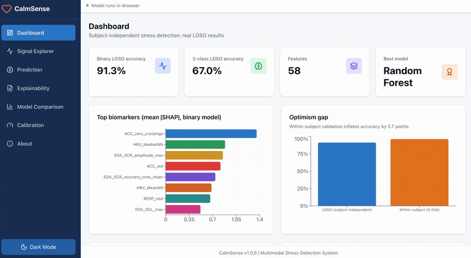

# CalmSense

### A Machine Learning and Deep Learning Framework for Wearable Biosignal Analysis, Integrating 1D CNNs, Explainable AI, Probability Calibration, and Cross-Dataset Evaluation.

[Live demo](https://urmeo.github.io/CalmSense/) · [Colab](https://colab.research.google.com/github/urmeo/CalmSense/blob/main/notebooks/CalmSense.ipynb)

## What this is

WESAD stress-vs-baseline benchmark using ECG, EDA, temperature, respiration and motion.
Leave-One-Subject-Out (LOSO): train on 14 subjects, test on the 15th, rotate.
Static dashboard shows committed results; make demo runs offline on synthetic signals.

## Results

Binary LOSO, means over 15 held-out subjects.

<table width="780">
<tr><th align="left" width="180">Model</th><th align="left" width="120">Accuracy</th><th align="left" width="120">F1 (macro)</th><th align="left" width="180">AUROC</th><th align="left" width="180">AUPRC</th></tr>
<tr><td>Random Forest</td><td>0.913</td><td>0.898</td><td>0.973</td><td>0.960</td></tr>
</table>

No significant difference among feature models (Friedman p = 0.81); RF accuracy 95% CI: [0.860, 0.960].
RF threshold (Youden J): 0.45 gives sensitivity 0.90, specificity 0.91, PPV 0.85, NPV 0.94.

- Leakage: same-person testing adds 13 points to 3-class accuracy (0.66 to 0.79); binary +5.7.
- Motion: dropping motion features changes accuracy from 0.913 to 0.901.
- Wrist: 0.893 vs chest 0.913 for the same model; best wrist 0.906, within noise.
- Transfer: recorded balanced accuracies 0.57/0.50; slope-unit mismatch needs a rerun.
- Calibration: isotonic recalibration lowers ECE from 0.070 to 0.025.
- Personalization: five enrollment windows beat global; 20 lower ECE from 0.146 to 0.069.

## Methods

58 features: HRV, EDA, temperature, respiration and motion. Logistic Regression, Random Forest, XGBoost and LightGBM use
median imputation and scaling fit per fold. NeuroKit2/SciPy, SHAP, PyTorch and React/TypeScript
support the pipeline and dashboard. [Model details](MODEL_CARD.md).

## Charts

<table width="780">
<tr>
<td align="center" width="260"> Model comparison (LOSO)</td>
<td align="center" width="260"> Optimism gap (leakage)</td>
<td align="center" width="260"> Feature ablation</td>
</tr>
<tr>
<td align="center" width="260"> Wrist vs chest</td>
<td align="center" width="260"> Cross-dataset transfer</td>
<td align="center" width="260"> Calibration reliability</td>
</tr>
<tr>
<td align="center" width="260"> Few-shot personalization</td>
<td align="center" width="260"> Top features (SHAP)</td>
<td align="center" width="260"> Confusion matrix</td>
</tr>
</table>

## Limitations

- 15 lab subjects: wide confidence intervals, low power, no clinical claim.
- Ablation, calibration and personalization are exploratory, without multiplicity correction; the raw-signal 1D-CNN is a small baseline.
- Synthetic scores only exercise the pipeline; they are not evidence of performance on real subjects.
- WESAD/PhysioNet Non-EEG transfer uses one confounded pair. EDA/TEMP slopes are per sample at different rates (4 Hz vs 8 Hz); scores require recomputation with harmonized units and do not isolate dataset shift. See [provenance](README.md).

## Ethics & data use

Research only. Physiological signals are sensitive personal data: minimize collection and retention;
never monitor or penalize people without informed consent. Datasets retain their own
licenses and are not redistributed.

## License

[MIT License](LICENSE)
