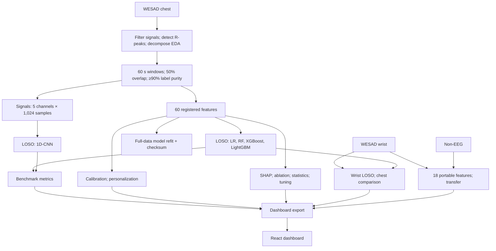

# CalmSense

### A Machine Learning and Deep Learning Framework for Wearable Biosignal Analysis, Integrating 1D CNNs, Explainable AI, Probability Calibration, and Cross-Dataset Evaluation.

[Live demo](https://urmeo.github.io/CalmSense/) · [Colab](https://colab.research.google.com/github/urmeo/CalmSense/blob/main/notebooks/CalmSense.ipynb) · [Code](#architecture) · [Model](#protocol--provenance)

## Overview

Stress classification from ECG, EDA, temperature, respiration, and motion.
**15-fold LOSO:** train on 14 subjects; test on one. Static results dashboard.

| **15** | **58** | **869** | **1,032** |
| :--: | :--: | :--: | :--: |
| WESAD subjects | Saved features | Binary windows | Three-class windows |

### Data flow

```mermaid
flowchart TD
    A["WESAD chest"] --> B["Filter signals; detect R-peaks; decompose EDA"]
    B --> C["60 s windows; 50% overlap; ≥90% label purity"]
    C --> D["60 registered features"]
    C --> R["Signals: 5 channels × 1,024 samples"]
    D --> E["LOSO: LR, RF, XGBoost, LightGBM"]
    R --> N["LOSO: 1D-CNN"]
    E --> F["Benchmark metrics"]
    N --> F
    D --> G["Calibration; personalization"]
    D --> H["SHAP; ablation; statistics; tuning"]
    D --> I["Full-data model refit + checksum"]
    W["WESAD wrist"] --> V["Wrist LOSO; chest comparison"]
    E --> V
    W --> P["18 portable features; transfer"]
    O["Non-EEG"] --> P
    F --> J["Dashboard export"]
    G --> J
    H --> J
    V --> J
    P --> J
    J --> K["React dashboard"]
```

## Results

**Binary: 91.0% (Random Forest)** · **Three-class: 67.2% (LightGBM)**

[4 October 2026 benchmark](outputs/results/provenance.json) · 15-fold LOSO.
Binary: baseline/stress; three-class adds amusement.

| Model | Binary acc | Binary F1 | AUROC* | AUPRC* | 3-class acc | 3-class F1 |
| :-- | --: | --: | --: | --: | --: | --: |
| Random Forest | **91.0%** | 0.895 | 0.973 | 0.959 | 65.1% | 0.542 |
| XGBoost | 90.8% | 0.881 | 0.973 | 0.957 | 64.2% | 0.562 |
| Logistic Regression | 91.0% | 0.893 | 0.963 | 0.953 | 65.9% | 0.603 |
| LightGBM | 88.9% | 0.855 | 0.964 | 0.944 | **67.2%** | 0.590 |
| 1D-CNN | 73.3% | 0.654 | n/a | n/a | 49.9% | 0.401 |

Accuracy/macro-F1: subject means. *AUROC/AUPRC: pooled held-out binary predictions; not computed for CNN.
RF pooled balanced accuracy: **89.9%**; accuracy **95% CI [85.8%, 95.6%]**.
Friedman **p = 0.599** (four feature models); no significant Holm-adjusted pairwise differences.

Matched pooled accuracy, LOSO → subject-mixed: RF binary **91.3% → 96.4% (+5.0 pp)**; LightGBM three-class **67.2% → 94.0% (+26.8 pp)**.
[Metrics](outputs/results/metrics.json) · [Statistics](outputs/results/stats.json)

## Graphs & charts

<table width="100%">
<tr>
<td align="center" width="50%"><strong>Binary accuracy · LOSO</strong></td>
<td align="center" width="50%"><strong>Three-class accuracy · LOSO</strong></td>
</tr>
<tr>
<td align="center" valign="middle" height="300" width="50%"></td>
<td align="center" valign="middle" height="300" width="50%"></td>
</tr>
<tr>
<td align="center">RF <b>0.910</b> · five models</td>
<td align="center">LightGBM <b>0.672</b> · five models</td>
</tr>
<tr>
<td align="center" width="50%"><strong>Subject leakage</strong></td>
<td align="center" width="50%"><strong>Across the 15 subjects</strong></td>
</tr>
<tr>
<td align="center" valign="middle" height="300" width="50%"></td>
<td align="center" valign="middle" height="300" width="50%"></td>
</tr>
<tr>
<td align="center"><b>0.913 → 0.964</b> · +5.0 pp</td>
<td align="center"><b>0.712 to 1.000</b> · RF accuracy</td>
</tr>
<tr>
<td align="center" width="50%"><strong>Feature ablation</strong></td>
<td align="center" width="50%"><strong>Chest vs wrist</strong></td>
</tr>
<tr>
<td align="center" valign="middle" height="300" width="50%"></td>
<td align="center" valign="middle" height="300" width="50%"></td>
</tr>
<tr>
<td align="center">RF: all <b>0.910</b> · no motion <b>0.901</b></td>
<td align="center">RF: chest <b>0.910</b> · wrist <b>0.890</b></td>
</tr>
<tr>
<td align="center" width="50%"><strong>Cross-dataset transfer</strong></td>
<td align="center" width="50%"><strong>SHAP explainability</strong></td>
</tr>
<tr>
<td align="center" valign="middle" height="300" width="50%"></td>
<td align="center" valign="middle" height="300" width="50%"></td>
</tr>
<tr>
<td align="center">Balanced accuracy: WESAD → Non-EEG <b>0.558</b> · reverse <b>0.497</b></td>
<td align="center">XGBoost full-data fit · motion, HRV, EDA</td>
</tr>
<tr>
<td align="center" width="50%"><strong>Probability calibration</strong></td>
<td align="center" width="50%"><strong>Few-shot personalization</strong></td>
</tr>
<tr>
<td align="center" valign="middle" height="300" width="50%"></td>
<td align="center" valign="middle" height="300" width="50%"></td>
</tr>
<tr>
<td align="center">RF full LOSO ECE: <b>0.077 → 0.026</b></td>
<td align="center">RF ECE: <b>0.162 → 0.078</b> · requested 20</td>
</tr>
<tr>
<td align="center" width="50%"><strong>Binary confusion · RF</strong></td>
<td align="center" width="50%"><strong>Three-class confusion · LightGBM</strong></td>
</tr>
<tr>
<td align="center" valign="middle" height="300" width="50%"></td>
<td align="center" valign="middle" height="300" width="50%"></td>
</tr>
<tr>
<td align="center">Pooled default decisions</td>
<td align="center">Pooled default decisions</td>
</tr>
</table>

Calibration & personalization

### Calibration

<!-- AUTOGEN:calibration START -->
| Evaluation | ECE | MCE | Brier |
| --- | :-: | :-: | :-: |
| Subject-mixed 5-fold, non-overlapping | 0.087 | 0.252 | 0.038 |
| LOSO, matched non-overlapping | 0.090 | 0.363 | 0.073 |
| LOSO, all windows | 0.077 | 0.177 | 0.069 |
| LOSO, all windows + isotonic | 0.026 | 0.350 | 0.064 |
<!-- AUTOGEN:calibration END -->

15 bins; pooled RF; training-subject OOF isotonic fit. Plot: all windows; matched rows: non-overlapping subset.
Brier: mean squared error of the stress probability.
[Decision curve](outputs/figures/calibration_decision_curve.png).

### Personalization

<!-- AUTOGEN:personalization START -->
| Recalibration / requested enrollment budget | ECE | Brier |
| --- | :-: | :-: |
| None (LOSO) | 0.162 | 0.073 |
| Global (training subjects) | 0.099 | 0.071 |
| Per-subject, budget 5 | 0.099 | 0.061 |
| Per-subject, budget 10 | 0.083 | 0.061 |
| Per-subject, budget 20 | 0.078 | 0.063 |
<!-- AUTOGEN:personalization END -->

Subject means; reserved-half evaluation; disjoint enrollment; no classifier retraining.
Budget 5 enrolls 4 balanced windows; class availability can reduce requests.

## Protocol & provenance

1. **Evaluation:** 15-fold LOSO; train-only preprocessing/calibration; subject means. *AUROC/AUPRC: [pooled OOF](outputs/results/threshold_metrics.json) for four feature models; no CNN.
2. **Model:** [Uncalibrated chest RF](outputs/models/stress_classifier.joblib); **58** features, **869** training windows; scikit-learn **1.6.1**. Use the [verified loader](src/utils.py) from a trusted checkout.
3. **Provenance:** [Validated rerun](outputs/results/provenance.json), **2026-10-04**, source `4f5c02f`, seed **42**; extraction/benchmark **v2**, portable **v3**. Tuning uses nested subject folds; exported RF keeps defaults. SHAP: full-data XGBoost; transfer units differ.

## Architecture

| Path | Contents |
| :-- | :-- |
| `src/` | Data, preprocessing, features, models, calibration |
| `scripts/` | Experiments, downloads, exports |
| `notebooks/` | Synthetic Colab demo |
| `frontend/` | Dashboard and configs |
| `outputs/{results,figures,models,dashboard}/` | Saved research and dashboard artifacts |
| `outputs/generated/` | Ignored caches, plots, logs, demo, site |

Settings/seed **42**: `src/config.py`. Experiments update results/models; plots stay under `generated/`.

## Models & features

| Model | Settings |
| :-- | :-- |
| Logistic Regression | C=1; L2; class-balanced |
| Random Forest | 200 trees; depth 10; class-balanced |
| XGBoost | 200 trees; depth 7; learning rate 0.1 |
| LightGBM | 200 trees; 50 leaves; learning rate 0.1 |
| 1D-CNN | Residual blocks; AdamW; early stopping |

**60 registered features**: HRV **30**, EDA **15**, temperature/respiration **10**, ACC **5**.
Saved **58** exclude all-NaN `RESP_inhale_exhale_ratio` and `RESP_variability`.

## Tech stack

| Layer | Technologies |
| :-- | :-- |
| Signals & data | Python, NumPy, pandas, SciPy, NeuroKit2 |
| Models & explanation | scikit-learn, XGBoost, LightGBM, PyTorch, SHAP |
| Figures | Matplotlib, Seaborn |
| Dashboard | React, TypeScript, esbuild, CSS, Apache ECharts |

## Limitations

1. **Cohort:** 15 lab subjects; wide CIs; no clinical validation.
2. **Analysis:** 60 s windows limit VLF and long-term DFA; exploratory ablation/calibration/personalization lack multiplicity correction. Pairwise model tests use Holm correction.
3. **Transfer:** One dataset pair; units, devices, stressors, and labels differ.

## Future work

1. Validate transfer on a third corpus with matched sensors/labels.
2. Test daily-life recordings outside the lab.
3. Measure live inference latency and wearable battery use.

## Ethics & data use

1. Obtain informed consent for physiological recordings.
2. Collect required signals only; omit identifiers.
3. Research use only; follow dataset terms.

## References

1. Schmidt et al. (2018). [Introducing WESAD, a Multimodal Dataset for Wearable Stress and Affect Detection](https://doi.org/10.1145/3242969.3242985). *ACM ICMI*, 400-408.
2. ESC/NASPE Task Force (1996). [Heart Rate Variability: Standards of Measurement, Physiological Interpretation, and Clinical Use](https://doi.org/10.1161/01.CIR.93.5.1043). *Circulation*, 93(5), 1043-1065.
3. Guo et al. (2017). [On Calibration of Modern Neural Networks](https://proceedings.mlr.press/v70/guo17a.html). *ICML*, PMLR 70, 1321-1330.
4. Vos et al. (2023). [Generalizable Machine Learning for Stress Monitoring from Wearable Devices: A Systematic Literature Review](https://doi.org/10.1016/j.ijmedinf.2023.105026). *International Journal of Medical Informatics*, 173, 105026.

## License

[MIT](LICENSE)
