# CalmSense

### A Machine Learning and Deep Learning Framework for Wearable Biosignal Analysis, Integrating 1D CNNs, Explainable AI, Probability Calibration, and Cross-Dataset Evaluation.

ML: Logistic Regression, Random Forest, XGBoost, LightGBM

DL: 1D-CNN, SHAP

[Live demo](https://urmeo.github.io/CalmSense/) · [Colab](https://colab.research.google.com/github/urmeo/CalmSense/blob/main/notebooks/CalmSense.ipynb) · [Structure](docs/ARCHITECTURE.md) · [Model card](docs/MODEL_CARD.md)

[](https://urmeo.github.io/CalmSense/)

## What this is

- Detects stress vs baseline from wearable signals: ECG, EDA (skin conductance), temperature, respiration, motion.
- Scored Leave-One-Subject-Out (LOSO): train on 14 people, test on the 15th, rotate.
- Shows where the usual high numbers come from: subject leakage, motion, dataset shift, calibration.
- Ships a static dashboard of the committed results (no backend). `make demo` runs the full pipeline offline on synthetic signals.

| **15** | **58** | **869** | **1,032** |
| :--: | :--: | :--: | :--: |
| WESAD subjects | Features | Binary windows | Three-class windows |

## Results

**15-fold LOSO** · baseline vs stress; three-class adds amusement.

| Model | Binary acc | Binary F1 | AUROC* | AUPRC* | 3-class acc | 3-class F1 |
| :-- | --: | --: | --: | --: | --: | --: |
| Random Forest | 0.913 | 0.898 | 0.973 | 0.960 | 0.637 | 0.535 |
| XGBoost | 0.903 | 0.873 | 0.975 | 0.960 | 0.633 | 0.552 |
| Logistic Regression | 0.902 | 0.883 | 0.959 | 0.947 | 0.670 | 0.613 |
| LightGBM | 0.894 | 0.860 | 0.965 | 0.946 | 0.658 | 0.568 |
| 1D-CNN | 0.718 | 0.648 | n/a | n/a | 0.626 | 0.543 |

Accuracy / macro-F1: subject means. *AUROC/AUPRC: separate pooled pass; see notes below.

**RF 95% CI: [0.860, 0.960]** · four feature models statistically tied (**p = 0.806**).

<details>
<summary>6 checks · numeric summary</summary>

| Check | Result |
| :-- | :-- |
| Subject leakage | Binary **0.907 → 0.964** (+5.7 pp) · three-class **0.658 → 0.792** (+13.3 pp) |
| Motion ablation | **0.913 → 0.901** without motion |
| Chest / wrist | **0.913 / 0.893** · same RF |
| Transfer | **0.573 / 0.500** balanced accuracy |
| Isotonic calibration | ECE **0.070 → 0.025** |
| Personalization | ECE **0.146 → 0.069** · requested 20 windows |

</details>

## Graphs & charts

Click figures to enlarge.

<table width="100%">
<tr>
<td align="center" valign="top" width="50%"><strong>Binary accuracy · LOSO</strong><br><a href="docs/figures/binary_model_comparison.png">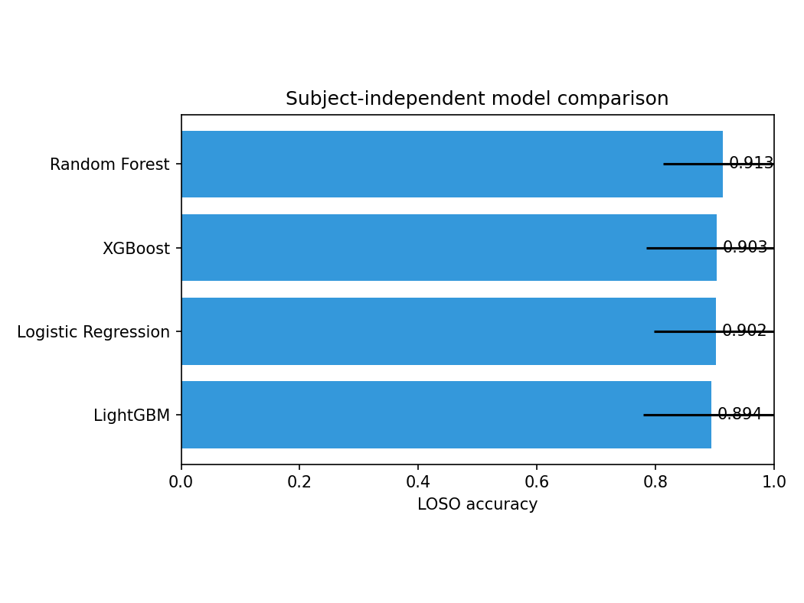</a><br><sub>RF <b>0.913</b> · four feature models</sub></td>
<td align="center" valign="top" width="50%"><strong>Three-class accuracy · LOSO</strong><br><a href="docs/figures/multiclass_model_comparison.png">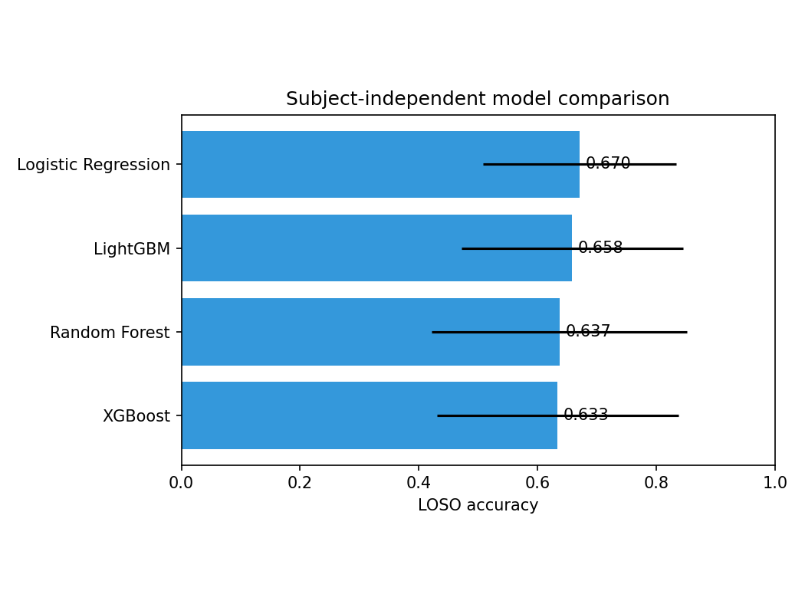</a><br><sub>LR <b>0.670</b> · four feature models</sub></td>
</tr>
<tr>
<td align="center" valign="top" width="50%"><strong>Subject leakage</strong><br><a href="docs/figures/binary_optimism_gap.png">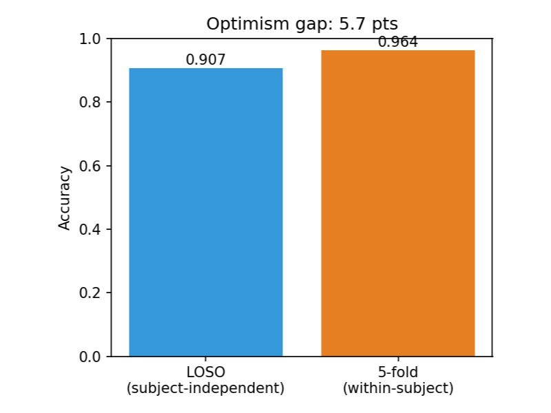</a><br><sub><b>0.907 → 0.964</b> · +5.7 pp</sub></td>
<td align="center" valign="top" width="50%"><strong>Across the 15 subjects</strong><br><a href="docs/figures/binary_per_subject.png">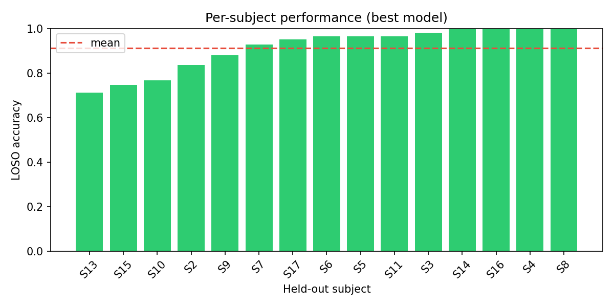</a><br><sub><b>0.712 to 1.000</b> · RF accuracy</sub></td>
</tr>
<tr>
<td align="center" valign="top" width="50%"><strong>Feature ablation</strong><br><a href="docs/figures/ablation.png">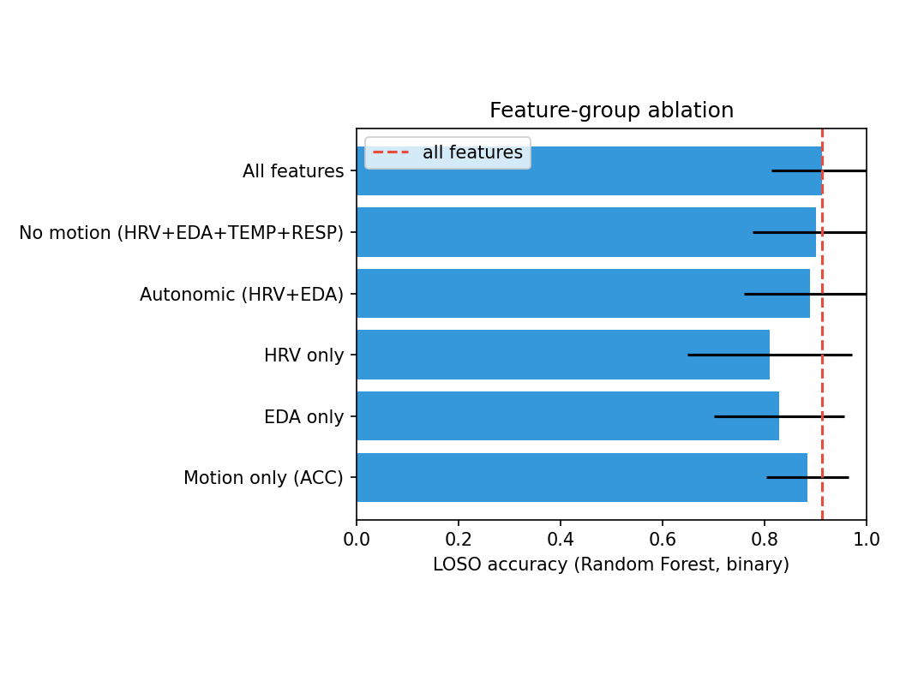</a><br><sub>All <b>0.913</b> · no motion <b>0.901</b></sub></td>
<td align="center" valign="top" width="50%"><strong>Chest vs wrist</strong><br><a href="docs/figures/chest_vs_wrist.png">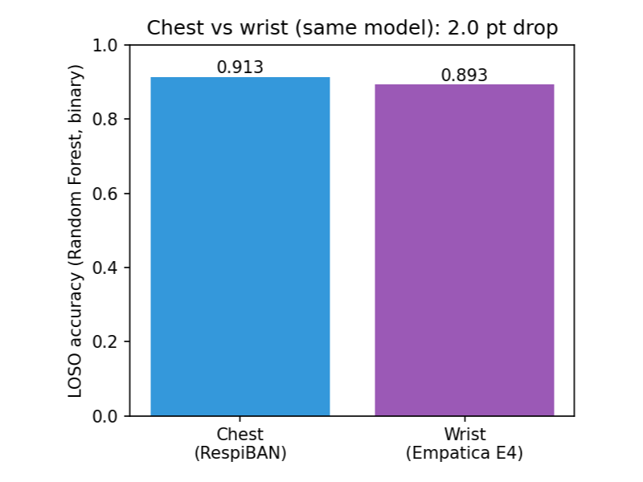</a><br><sub>RF: <b>0.913 vs 0.893</b></sub></td>
</tr>
<tr>
<td align="center" valign="top" width="50%"><strong>Cross-dataset transfer</strong><br><a href="docs/figures/cross_dataset.png"></a><br><sub>Balanced accuracy: <b>0.573 / 0.500</b></sub></td>
<td align="center" valign="top" width="50%"><strong>SHAP explainability</strong><br><a href="docs/figures/shap_beeswarm.png">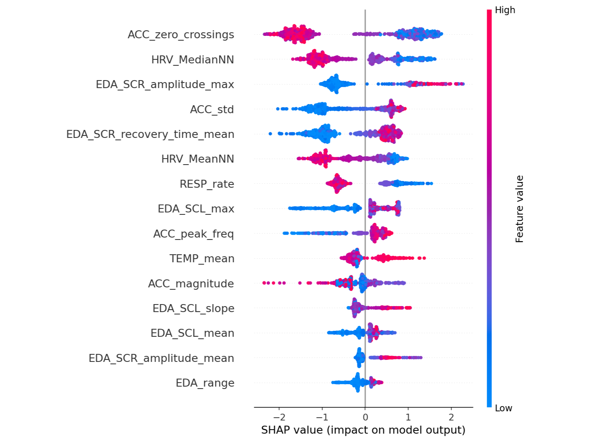</a><br><sub>Full-data fit: motion · heart rate · EDA · respiration</sub></td>
</tr>
<tr>
<td align="center" valign="top" width="50%"><strong>Probability calibration</strong><br><a href="docs/figures/calibration_reliability.png">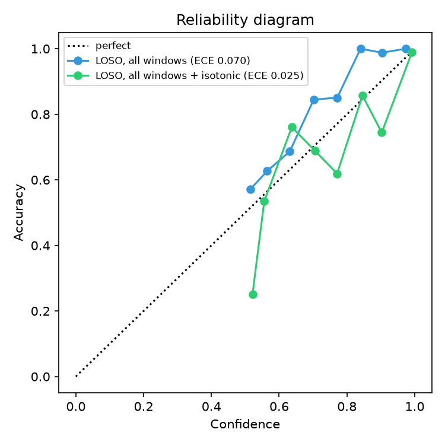</a><br><sub>Full LOSO ECE: <b>0.070 → 0.025</b></sub></td>
<td align="center" valign="top" width="50%"><strong>Few-shot personalization</strong><br><a href="docs/figures/personalization.png">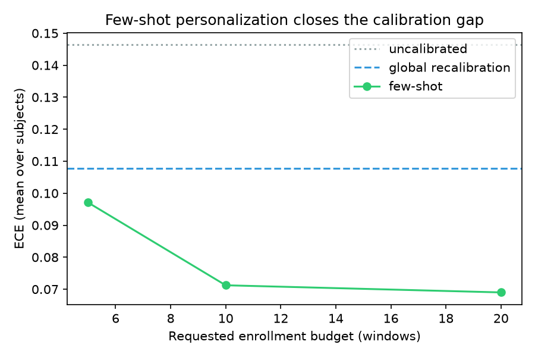</a><br><sub>ECE: <b>0.146 → 0.069</b> · requested 20</sub></td>
</tr>
<tr>
<td align="center" valign="top" width="50%"><strong>Binary confusion · RF</strong><br><a href="docs/figures/binary_confusion.png">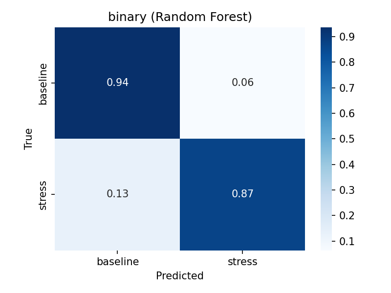</a><br><sub>Stress recall <b>≈0.87</b> · default decisions</sub></td>
<td align="center" valign="top" width="50%"><strong>Three-class confusion · LR</strong><br><a href="docs/figures/multiclass_confusion.png">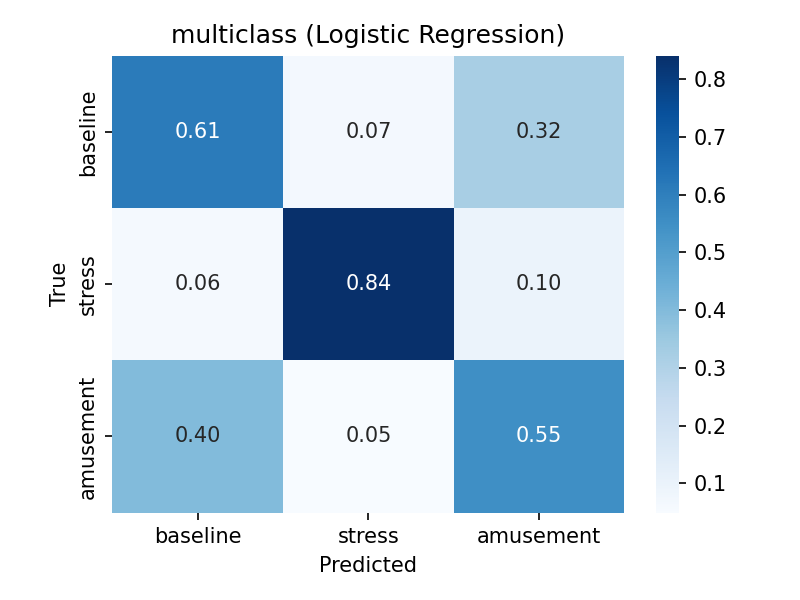</a><br><sub>Baseline ↔ amusement confusion</sub></td>
</tr>
</table>

<details>
<summary>Calibration and personalization · full metrics</summary>

### Probability calibration

<!-- AUTOGEN:calibration START -->
| Evaluation | ECE | MCE | Brier |
| --- | :-: | :-: | :-: |
| Subject-mixed 5-fold, non-overlapping | 0.085 | 0.290 | 0.077 |
| LOSO, matched non-overlapping | 0.090 | 0.256 | 0.144 |
| LOSO, all windows | 0.070 | 0.160 | 0.136 |
| LOSO, all windows + isotonic | 0.025 | 0.271 | 0.129 |
<!-- AUTOGEN:calibration END -->

15 bins; pooled binary RF predictions. Isotonic uses training-subject OOF probabilities.
The plot shows full LOSO and subject-mixed curves; compare matched windows in the table.

### Personalization through probability recalibration

<!-- AUTOGEN:personalization START -->
| Recalibration / requested enrollment budget | ECE | Brier |
| --- | :-: | :-: |
| None (LOSO) | 0.146 | 0.073 |
| Global (training subjects) | 0.108 | 0.074 |
| Per-subject, budget 5 | 0.097 | 0.061 |
| Per-subject, budget 10 | 0.071 | 0.059 |
| Per-subject, budget 20 | 0.069 | 0.058 |
<!-- AUTOGEN:personalization END -->

Subject means on a reserved half; no classifier retraining. Budgets are requests:
5 draws 4 balanced windows; class availability can reduce enrollment.

</details>

<details>
<summary>Protocol and metric notes</summary>

### Data and evaluation protocol

| Dataset | Subjects | Role |
| :-- | --: | :-- |
| WESAD | 15 | Primary LOSO benchmark |
| PhysioNet Non-EEG | 20 | Transfer only |

60 s windows · 50% overlap · ≥90% label agreement; meditation excluded.
Imputation/scaling/balancing/calibration use training subjects only.
Leakage gaps use matched non-overlapping windows; chart error bars are subject SDs.
Chest/wrist differences do not establish sensor equivalence.

*AUROC/AUPRC: pooled OOF [threshold pass](results/threshold_metrics.json);
AUPRC is average precision. XGBoost omits benchmark sample weights; CNN values unavailable.

RF Youden J: **0.454** threshold · sensitivity **0.902** · specificity **0.913** ·
PPV **0.850** · NPV **0.945**. Selected on the evaluated predictions; exploratory.
Confusion matrices instead use default decisions, pooled and row-normalized.

### Cross-dataset transfer

18 shared features; balanced accuracy. Within WESAD **0.864**; within Non-EEG **0.699**.
Transfer is confounded by devices, stressors, and labels. SHAP explains a full-data fit;
it is not causal or held-out evidence.

### Shipped model

The [shipped RF](outputs/models/stress_classifier.joblib) is refit on all 869 binary windows;
LOSO evaluates separate fits. No pretrained third-party weights.

Sources: [benchmark](results/metrics.json) · [statistics](results/stats.json) ·
[ablation](results/ablation.csv) · [wrist](results/wrist.json) · [transfer](results/cross_dataset.json).

</details>

<details>
<summary>Run and reproduce · datasets and integrity</summary>

Python **3.11 / 3.12**. From the repository root:

```bash
python -m venv .venv
source .venv/bin/activate
make install-dev
make demo                     # offline synthetic smoke check
```

### Dataset download and integrity

WESAD: [official UCI source](https://archive.ics.uci.edu/dataset/465/wesad+wearable+stress+and+affect+detection),
research agreement; not redistributed. Non-EEG downloads directly.

```bash
make wesad                    # data/raw/WESAD
make data                     # data/external/noneeg
python scripts/download_data.py --verify-wesad
make reproduce                # regenerates scientific outputs
```

Manual extraction: `data/raw/WESAD/S2/S2.pkl` through `S17/S17.pkl`, excluding S12.
`latin1` pickles: chest ACC/ECG/EMG/EDA/Temp/Resp and labels **700 Hz**;
wrist ACC **32 Hz**, BVP **64 Hz**, EDA/TEMP **4 Hz**.
Labels: **1** baseline · **2** stress · **3** amusement; **0, 4 to 7** excluded.
Binary uses 1/2; three-class uses 1/2/3.

No official version tag/checksums; verification uses all 15 committed SHA-256 references.
Trusted pickles only: [security](SECURITY.md). macOS OpenMP: `brew install libomp`.
`requirements.lock` records the published environment; newer NeuroKit2 can change wrist/transfer
results (commit `61d0d2c`). `make demo` provides no scientific evidence.

Tables: `python scripts/update_readme_tables.py`. [Results snapshot](results/README.md) ·
[Dashboard setup](frontend/README.md) · [Architecture](docs/ARCHITECTURE.md) · [Contributing](CONTRIBUTING.md).

</details>

## Models

<details>
<summary>5 models · settings</summary>

<table width="100%">
<tr><th align="left" width="220">Model</th><th align="left" width="230">Type</th><th align="left" width="330">Key settings</th></tr>
<tr><td>Logistic Regression</td><td>Linear</td><td>C=1.0, L2, class-balanced</td></tr>
<tr><td>Random Forest</td><td>Bagged trees</td><td>200 trees, depth 10, class-balanced</td></tr>
<tr><td>XGBoost</td><td>Boosted trees</td><td>200 trees, depth 7, lr 0.1</td></tr>
<tr><td>LightGBM</td><td>Boosted trees</td><td>200 trees, 50 leaves, lr 0.1</td></tr>
<tr><td>1D-CNN</td><td>Deep net on raw signal</td><td>Residual blocks, AdamW, early stopping</td></tr>
</table>

Feature models: fold-local imputation/scaling. CNN: raw windows.

</details>

## Features (58)

<details>
<summary>6 groups · counts and examples</summary>

<table width="100%">
<tr><th align="left" width="220">Group</th><th align="left" width="230">Count</th><th align="left" width="330">Examples</th></tr>
<tr><td>HRV time domain</td><td>12</td><td>MeanNN, SDNN, RMSSD, pNN50</td></tr>
<tr><td>HRV frequency</td><td>8</td><td>LF/HF power, LF/HF ratio</td></tr>
<tr><td>HRV nonlinear</td><td>10</td><td>SampEn, DFA, SD1/SD2, CSI</td></tr>
<tr><td>EDA (skin conductance)</td><td>15</td><td>SCL level, SCR count, SCR amplitude</td></tr>
<tr><td>Temperature + respiration</td><td>8</td><td>temp slope, respiration rate</td></tr>
<tr><td>Accelerometer (motion)</td><td>5</td><td>magnitude mean, std, energy</td></tr>
</table>

</details>

## Tech stack

<details>
<summary>Python research pipeline · React dashboard</summary>

<table width="100%">
<tr><th align="left" width="220">Area</th><th align="left" width="560">Tools</th></tr>
<tr><td>Modelling</td><td>scikit-learn, XGBoost, LightGBM, PyTorch</td></tr>
<tr><td>Signal processing</td><td>NeuroKit2, SciPy</td></tr>
<tr><td>Explainability</td><td>SHAP</td></tr>
<tr><td>Dashboard</td><td>React, TypeScript</td></tr>
<tr><td>Tooling</td><td>GitHub Actions, ruff, mypy, pytest</td></tr>
</table>

</details>

## Limitations

- **15 lab subjects** · wide CIs · weak CNN baseline · no clinical claim.
- Exploratory ablation/calibration/personalization; no multiplicity correction. One confounded transfer pair.

## Future work

Third matched corpus · free-living data · streaming wearable inference.

## Ethics & data use

Sensitive signals: informed consent, minimal collection, research use only. Dataset licenses apply.

## License

[MIT](LICENSE) · [Software citation](CITATION.cff)

<details>
<summary>Scientific references · dataset and method attribution</summary>

- Schmidt, Reiss, Duerichen, Marberger, and Van Laerhoven. "Introducing WESAD, a Multimodal Dataset for Wearable Stress and Affect Detection." ICMI, 2018.
- Birjandtalab, Cogan, Pouyan, and Nourani. "A Non-EEG Dataset for Assessment of Neurological Status." IEEE BHI / PhysioNet, 2016.
- Task Force of the ESC and NASPE. "Heart Rate Variability: Standards of Measurement, Physiological Interpretation, and Clinical Use." Circulation, 1996.
- Guo, Pleiss, Sun, and Weinberger. "On Calibration of Modern Neural Networks." ICML, 2017.
- Vickers and Elkin. "Decision Curve Analysis: A Novel Method for Evaluating Prediction Models." Medical Decision Making, 2006. The committed [decision-curve figure](docs/figures/calibration_decision_curve.png) remains available.
- Lundberg and Lee. "A Unified Approach to Interpreting Model Predictions." NeurIPS, 2017.
- Bhanushali et al. "Stress Classification and Personalization: Getting the Most out of the Least." arXiv:2107.05666, 2021.
- Vos, Trinh, Sarnyai, and Rahimi Azghadi. "Generalizable Machine Learning for Stress Monitoring from Wearable Devices: A Systematic Literature Review." International Journal of Medical Informatics 173, 105026, 2023.
- Oliver and Dakshit. "Cross-Modality Investigation on WESAD Stress Classification." arXiv:2502.18733, 2025.
- Benchekroun et al. "Cross Dataset Analysis for Generalizability of HRV-Based Stress Detection Models." Sensors 23(4), 1807, 2023.
- Prajod, Mahesh, and André. "Stressor Type Matters! Exploring Factors Influencing Cross-Dataset Generalizability of Physiological Stress Detection." ICMI Companion, 2024.
- Vos et al. "Ensemble Machine Learning Model Trained on a New Synthesized Dataset Generalizes Well for Stress Prediction Using Wearable Devices." Journal of Biomedical Informatics, 2023.

### WESAD dataset citation

```bibtex
@inproceedings{schmidt2018wesad,
  title     = {Introducing WESAD, a Multimodal Dataset for Wearable Stress and Affect Detection},
  author    = {Schmidt, Philip and Reiss, Attila and Duerichen, Robert and Marberger, Claus and Van Laerhoven, Kristof},
  booktitle = {Proceedings of the 20th ACM International Conference on Multimodal Interaction},
  pages     = {400--408},
  year      = {2018}
}
```


</details>
