# CalmSense

### A Machine Learning and Deep Learning Framework for Wearable Biosignal Analysis, Integrating 1D CNNs, Explainable AI, Probability Calibration, and Cross-Dataset Evaluation.

[Live demo](https://urmeo.github.io/CalmSense/) · [Colab](https://colab.research.google.com/github/urmeo/CalmSense/blob/main/notebooks/CalmSense.ipynb) · [Structure](#architecture) · [Shipped model](#shipped-model)

[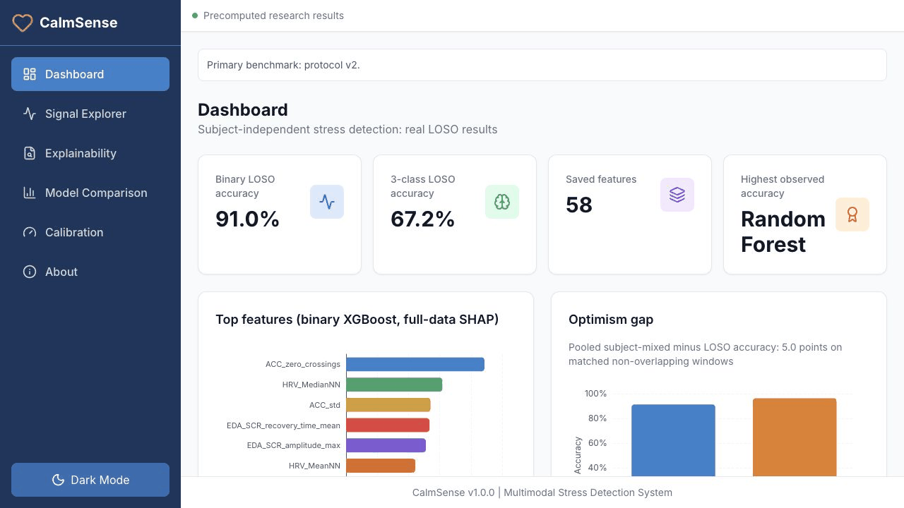](https://urmeo.github.io/CalmSense/)

## Overview

Stress classification from ECG, EDA, temperature, respiration, and motion.
**LOSO:** train on 14 subjects, test on the 15th; repeat for all 15.
The static dashboard displays committed results.

| **15** | **58** | **869** | **1,032** |
| :--: | :--: | :--: | :--: |
| WESAD subjects | Saved features | Binary windows | Three-class windows |

## Results

**Saved benchmark from the earlier pipeline.** Corrected code requires a fresh benchmark; see [provenance](#result-provenance).

**15-fold LOSO** · baseline vs stress; three-class adds amusement.

| Model | Binary acc | Binary F1 | AUROC* | AUPRC* | 3-class acc | 3-class F1 |
| :-- | --: | --: | --: | --: | --: | --: |
| Random Forest | 0.913 | 0.898 | 0.973 | 0.960 | 0.637 | 0.535 |
| XGBoost | 0.903 | 0.873 | 0.975 | 0.960 | 0.633 | 0.552 |
| Logistic Regression | 0.902 | 0.883 | 0.959 | 0.947 | 0.670 | 0.613 |
| LightGBM | 0.894 | 0.860 | 0.965 | 0.946 | 0.658 | 0.568 |
| 1D-CNN | 0.718 | 0.648 | n/a | n/a | 0.626 | 0.543 |

Accuracy / macro-F1: subject means. *AUROC/AUPRC: separate pooled pass; see notes below.
Saved comparison CSVs and plots contain four feature models; `metrics.json` also records the CNN.
RF balanced accuracy: **0.903** (pooled default decisions).

**RF accuracy 95% CI: [0.860, 0.960]** · no significant difference detected among four feature models (**p = 0.806**).

<details>
<summary>6 checks · numeric summary</summary>

| Check | Result |
| :-- | :-- |
| Subject leakage | Binary **0.907 → 0.964** (+5.7 pp) · three-class **0.658 → 0.792** (+13.3 pp) |
| Motion ablation | **0.913 → 0.901** without motion |
| Chest / wrist | **0.913 / 0.893** · same RF |
| Transfer | **0.557 / 0.494** balanced accuracy |
| Isotonic calibration | ECE **0.070 → 0.025** |
| Personalization | ECE **0.146 → 0.069** · requested 20 windows |

</details>

## Graphs & charts

Click figures to enlarge.

<table width="100%">
<tr>
<td align="center" valign="top" width="50%"><strong>Binary accuracy · LOSO</strong><br><a href="outputs/figures/binary_model_comparison.png">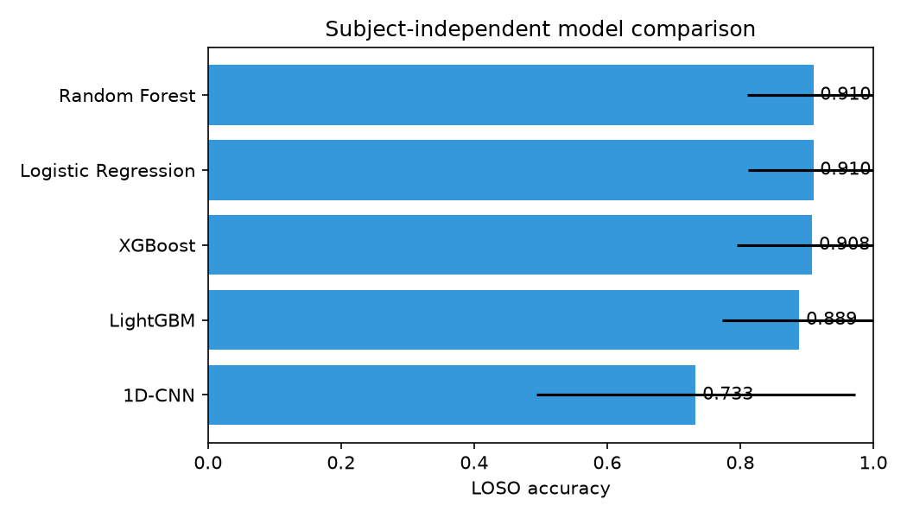</a><br><sub>RF <b>0.913</b> · four feature models</sub></td>
<td align="center" valign="top" width="50%"><strong>Three-class accuracy · LOSO</strong><br><a href="outputs/figures/multiclass_model_comparison.png">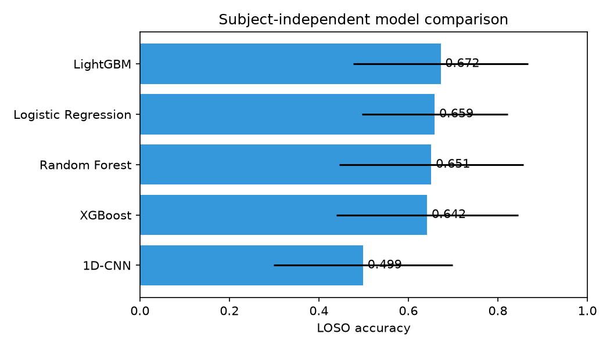</a><br><sub>LR <b>0.670</b> · four feature models</sub></td>
</tr>
<tr>
<td align="center" valign="top" width="50%"><strong>Subject leakage</strong><br><a href="outputs/figures/binary_optimism_gap.png">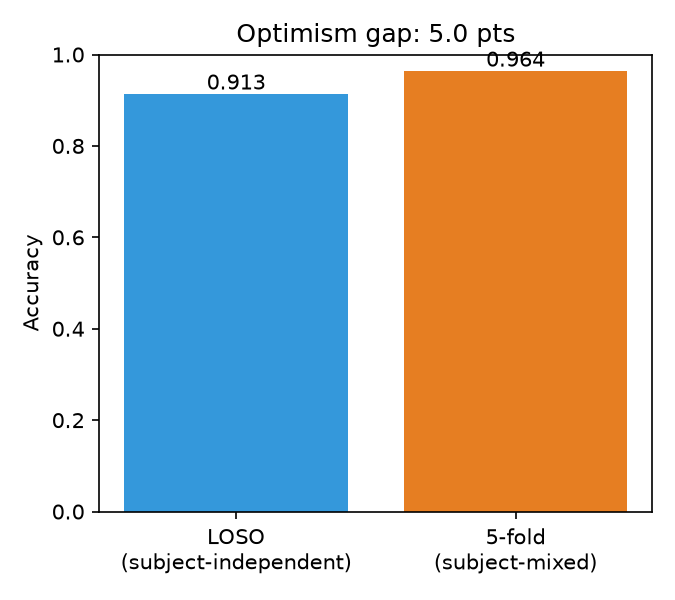</a><br><sub><b>0.907 → 0.964</b> · +5.7 pp</sub></td>
<td align="center" valign="top" width="50%"><strong>Across the 15 subjects</strong><br><a href="outputs/figures/binary_per_subject.png"></a><br><sub><b>0.712 to 1.000</b> · RF accuracy</sub></td>
</tr>
<tr>
<td align="center" valign="top" width="50%"><strong>Feature ablation</strong><br><a href="outputs/figures/ablation.png">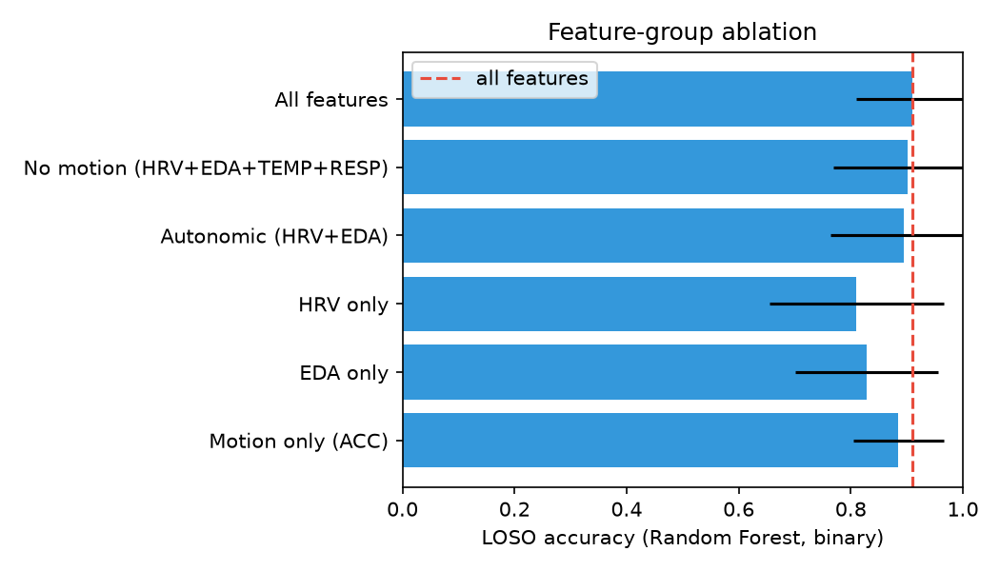</a><br><sub>All <b>0.913</b> · no motion <b>0.901</b></sub></td>
<td align="center" valign="top" width="50%"><strong>Chest vs wrist</strong><br><a href="outputs/figures/chest_vs_wrist.png">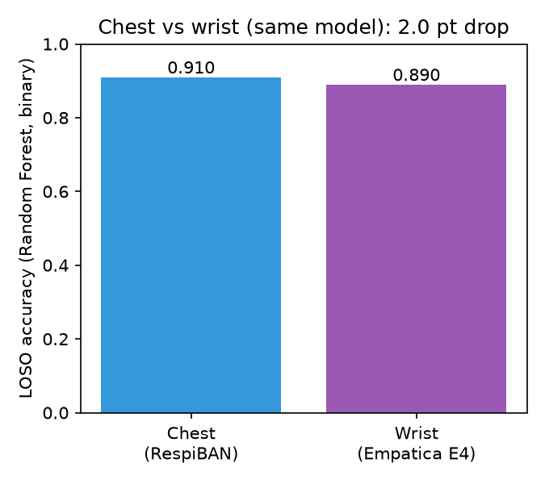</a><br><sub>RF: <b>0.913 vs 0.893</b></sub></td>
</tr>
<tr>
<td align="center" valign="top" width="50%"><strong>Cross-dataset transfer</strong><br><a href="outputs/figures/cross_dataset.png">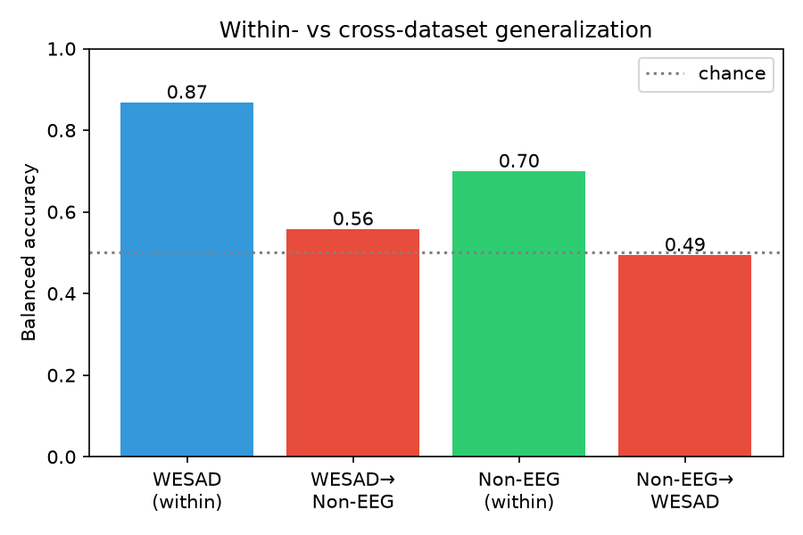</a><br><sub>Balanced accuracy: <b>0.557 / 0.494</b></sub></td>
<td align="center" valign="top" width="50%"><strong>SHAP explainability</strong><br><a href="outputs/figures/shap_beeswarm.png">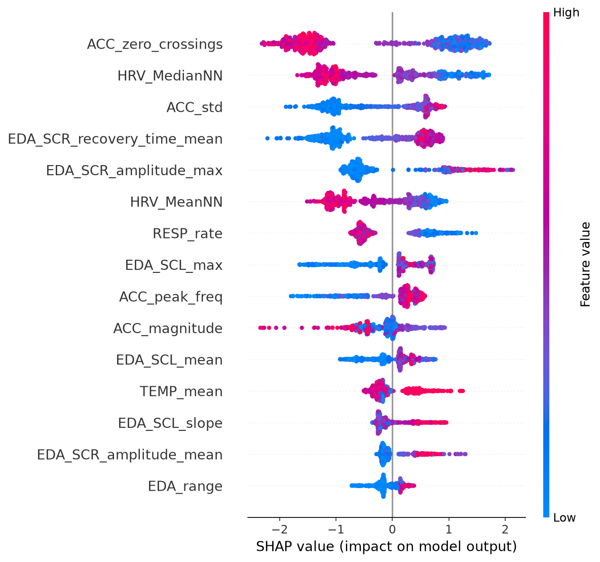</a><br><sub>Full-data fit: motion · heart rate · EDA · respiration</sub></td>
</tr>
<tr>
<td align="center" valign="top" width="50%"><strong>Probability calibration</strong><br><a href="outputs/figures/calibration_reliability.png"></a><br><sub>Full LOSO ECE: <b>0.070 → 0.025</b></sub></td>
<td align="center" valign="top" width="50%"><strong>Few-shot personalization</strong><br><a href="outputs/figures/personalization.png"></a><br><sub>ECE: <b>0.146 → 0.069</b> · requested 20</sub></td>
</tr>
<tr>
<td align="center" valign="top" width="50%"><strong>Binary confusion · RF</strong><br><a href="outputs/figures/binary_confusion.png">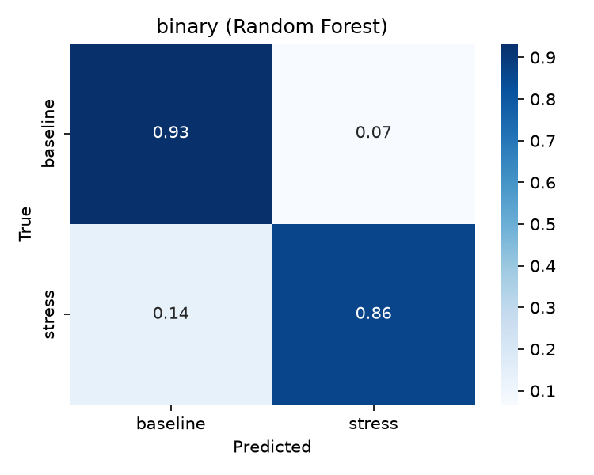</a><br><sub>Stress recall <b>≈0.87</b> · default decisions</sub></td>
<td align="center" valign="top" width="50%"><strong>Three-class confusion · LR</strong><br><a href="outputs/figures/multiclass_confusion.png">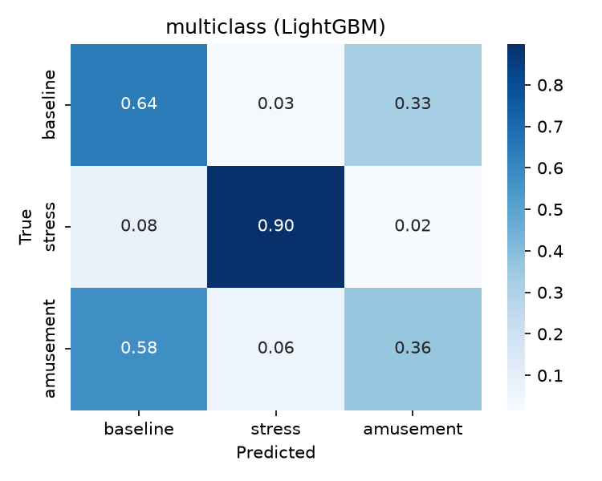</a><br><sub>Baseline ↔ amusement confusion</sub></td>
</tr>
</table>

<details>
<summary>Calibration and personalization · full metrics</summary>

### Probability calibration

<!-- AUTOGEN:calibration START -->
| Evaluation | ECE | MCE | Brier |
| --- | :-: | :-: | :-: |
| Subject-mixed 5-fold, non-overlapping | 0.085 | 0.290 | 0.038 |
| LOSO, matched non-overlapping | 0.090 | 0.256 | 0.072 |
| LOSO, all windows | 0.070 | 0.160 | 0.068 |
| LOSO, all windows + isotonic | 0.025 | 0.271 | 0.064 |
<!-- AUTOGEN:calibration END -->

15 bins; pooled binary RF predictions; isotonic fitted to training-subject OOF probabilities.
The plot uses full-window LOSO; matched windows are separate rows.
Binary Brier is stress-probability MSE; multiclass sums squared class errors.
Historical two-class Brier scores and paired gap/CI are halved for display; source values, ECE, curves and p-values remain unchanged.

[Decision-curve analysis](outputs/figures/calibration_decision_curve.png).

### Personalization through probability recalibration

<!-- AUTOGEN:personalization START -->
| Recalibration / requested enrollment budget | ECE | Brier |
| --- | :-: | :-: |
| None (LOSO) | 0.146 | 0.073 |
| Global (training subjects) | 0.108 | 0.074 |
| Per-subject, budget 5 | 0.097 | 0.061 |
| Per-subject, budget 10 | 0.071 | 0.059 |
| Per-subject, budget 20 | 0.069 | 0.058 |
<!-- AUTOGEN:personalization END -->

Subject means on a reserved half; no classifier retraining. Budgets are requests:
5 draws 4 balanced windows; class availability can reduce enrollment. Brier uses the same positive-class MSE convention.
Enrollment and evaluation windows are disjoint.

</details>

<details>
<summary>Protocol and metric notes</summary>

### Data and evaluation protocol

| Dataset | Subjects | Role |
| :-- | --: | :-- |
| WESAD | 15 | Primary LOSO benchmark |
| PhysioNet Non-EEG | 20 | Transfer only |

60 s windows · 50% overlap · ≥90% label agreement; meditation excluded.
Imputation/scaling/balancing/calibration use training subjects only.
Leakage gaps use matched non-overlapping windows; chart error bars are subject SDs.
Chest/wrist differences do not establish sensor equivalence.

*AUROC/AUPRC: pooled OOF [threshold pass](outputs/results/threshold_metrics.json);
AUPRC is average precision. XGBoost omits benchmark sample weights; CNN values unavailable.

RF Youden J: **0.454** threshold · sensitivity **0.902** · specificity **0.913** ·
PPV **0.850** · NPV **0.945**. Selected on the evaluated predictions; exploratory.
Confusion matrices instead use default decisions, pooled and row-normalized.

### Cross-dataset transfer

Saved wrist-feature RF; 18 shared features; portable schema v2; balanced accuracy. Within WESAD **0.868**; within Non-EEG **0.699**.
15 WESAD / 20 Non-EEG subjects; NeuroKit2 0.2.12. Heart-rate extraction differs from the benchmark's 0.2.7 environment.
Portable features preserve sample timestamps when non-finite values are omitted.
Units are not harmonized: WESAD ACC uses [1/64 g ticks](https://www.empatica.com/blog/decoding-wearable-sensor-signals-what-to-expect-from-your-e4-data/);
Non-EEG ACC/EDA headers declare NU. No physical conversion is supplied.
Transfer is confounded by units, devices, stressors, and labels. SHAP explains a full-data fit;
it is not causal or held-out evidence.

### Shipped model

The [shipped chest RF](outputs/models/stress_classifier.joblib) is refit on all **869** binary windows;
LOSO evaluates separate fits. Median imputation → standardization → RF, trained with **scikit-learn 1.6.1**.
Outputs: baseline/stress label and **uncalibrated stress probability**; recalibration maps are not bundled.
This model uses the original feature definitions. Refit it before using schema v2 features.
No pretrained third-party weights. [Checksum verification](SECURITY.md).

Sources: [benchmark](outputs/results/metrics.json) · [statistics](outputs/results/stats.json) ·
[ablation](outputs/results/ablation.csv) · [wrist](outputs/results/wrist.json) · [transfer](outputs/results/cross_dataset.json).

### Result provenance

[Benchmark metadata](outputs/results/provenance.json) · [Transfer metadata](outputs/results/cross_dataset.json).
Transfer records raw-file manifests, source-file hashes and a working-tree dirty flag.

Published metrics, figures, and the shipped model are preserved historical snapshots.
Current extraction **schema v2** corrects HRV spectra, entropy, recurrence, slopes, and filtering;
benchmark **protocol v2** holds out subjects for CNN validation and weights the XGBoost threshold pass.
CNN LOSO reserves 3 of 14 training subjects for early stopping; 11 supply gradients and normalization.
Portable **schema v3** also corrects Non-EEG heart-rate alignment at fractional-second window boundaries.
Fresh extraction and model fitting are required to report results from this code.

</details>

<details>
<summary>Run and reproduce · datasets and integrity</summary>

Python **3.11 / 3.12**. From the repository root:

```bash
python -m venv .venv
source .venv/bin/activate
python -m pip install -e ".[dev]"
python scripts/calibration.py --synthetic  # offline calibration smoke check
```

### Dataset download and integrity

WESAD: [official UCI source](https://archive.ics.uci.edu/dataset/465/wesad+wearable+stress+and+affect+detection),
research agreement; not redistributed.
Non-EEG: [PhysioNet source](https://physionet.org/content/noneeg/1.0.0/), downloads directly;
[Birjandtalab et al., IEEE SiPS 2016](https://doi.org/10.1109/SiPS.2016.27).

```bash
python scripts/download_data.py --wesad  # data/raw/WESAD
python scripts/download_data.py          # data/external/noneeg
python scripts/download_data.py --verify-wesad
python scripts/download_data.py --verify-noneeg
```

Manual extraction: `data/raw/WESAD/S2/S2.pkl` through `S17/S17.pkl`, excluding S12.
`latin1` pickles: chest ACC/ECG/EMG/EDA/Temp/Resp and labels **700 Hz**;
wrist ACC **32 Hz**, BVP **64 Hz**, EDA/TEMP **4 Hz**.
Labels: **1** baseline · **2** stress · **3** amusement; **0, 4 to 7** excluded.
Binary uses 1/2; three-class uses 1/2/3.

WESAD verification uses all 15 repository SHA-256 references; Non-EEG uses the publisher's manifest.
Trusted pickles only: [security](SECURITY.md). macOS OpenMP: `brew install libomp`.
Package environments: [benchmark](outputs/results/provenance.json) · [transfer](outputs/results/cross_dataset.json).
NeuroKit2 versions can change wrist/transfer results. The synthetic demo provides no scientific evidence.

### Reproduce experiments

After downloading both datasets, run these scripts in order to generate current results, local figures,
the model and checksum, README tables, and dashboard data:

```bash
python scripts/run_experiment.py
python scripts/ablation.py
python scripts/wrist.py
python scripts/cross_dataset.py --rebuild
python scripts/calibration.py
python scripts/personalize.py
python scripts/update_readme_tables.py
python scripts/tuning.py
python scripts/stats.py
python scripts/threshold_metrics.py
python scripts/build_dashboard_data.py
python scripts/stamp_provenance.py
```

The README updater refreshes only its two marked tables. Review benchmark summaries and
committed figures explicitly before publishing a new run; dashboard ancillary snapshots remain
unverified unless linked to their source benchmark.

Legacy chest/wrist caches rebuild automatically. Transfer caches verify extractor hashes and package versions;
`--rebuild` replaces stale caches. Provenance stamping records the current environment and file hashes;
it does not prove that this environment produced existing results.

### Dashboard development

Node **24** and npm. From `frontend/`:

```bash
node tooling.mjs install
node tooling.mjs dev
node tooling.mjs test     # Dashboard regression checks
node tooling.mjs build    # TypeScript check and production build
node tooling.mjs preview
node tooling.mjs audit
node tooling.mjs update   # Dependency edits: review source lock changes
```

Edit `frontend/config/*.mjs`; commands generate ignored npm/TypeScript JSON files.
GitHub dependency discovery does not read the custom manifest.
CI installs locked dependencies, blocks moderate or higher frontend audit findings, builds once and publishes `outputs/generated/site/`
under `/CalmSense/` with a deep-link fallback after all checks pass on `main` (push or manual run).
From the repository root: `python scripts/build_dashboard_data.py` refreshes dashboard results;
`python scripts/export_signals.py` refreshes signal snapshots and requires WESAD.

</details>

## Architecture

<details>
<summary>Repository layout · 8 pipeline stages · data flow</summary>

### Repository layout

| Location | Contents |
| --- | --- |
| `src/` · `scripts/` | Research modules and experiment commands |
| `notebooks/` | Runnable synthetic demo |
| `frontend/src/pages/` · `components/` | Dashboard views and shared UI |
| `frontend/config/` · `frontend/tooling.mjs` | Configuration sources and dashboard commands |
| `data/` | Local raw datasets |
| `outputs/results/` | Committed metrics, tables, history and provenance |
| `outputs/figures/` | Committed research plots and `demo.gif` |
| `outputs/models/` | Shipped model and SHA-256 checksum |
| `outputs/dashboard/` | Committed results and signal modules |
| `outputs/generated/` | Ignored caches, figures, logs, site builds and synthetic runs |

Experiments refresh `results/` and `models/`; local plots use `generated/figures/`.
Synthetic outputs stay in `generated/demo/{results,figures,models}/`; committed figures remain separate.

### Pipeline stages

| Stage | Operation | Code |
| --- | --- | --- |
| 1. Ingest | WESAD chest/wrist pickles; Non-EEG records for transfer | `src/data/loader.py`, `src/datasets/non_eeg.py` |
| 2. Preprocess | Butterworth filtering, ECG R-peaks and ectopic correction, EDA tonic/phasic decomposition | `src/preprocessing/{filters,ecg_processor,eda_processor}.py` |
| 3. Window | 60 s; 50% overlap; ≥90% label purity | `src/dataset.py` (chest), `src/dataset_wrist.py` (wrist), shared `window_label()` |
| 4. Features | 60-column extraction schema; saved benchmark used 58 after dropping two all-NaN respiration columns | `src/features/feature_pipeline.py` and modality extractors |
| 5. Benchmark | LOSO; training-fold imputation/scaling/balancing; LR/RF/XGBoost/LightGBM and raw-window 1D-CNN | `scripts/run_experiment.py`, `src/models/ml/classifiers.py`, `src/models/dl/cnn_1d.py` |
| 6. Calibration | ECE/MCE/Brier, decision-curve net benefit, training-subject recalibration, few-shot personalization | `src/calibration.py`, `scripts/{calibration,personalize}.py` |
| 7. Analysis | Optimism gap, ablation, wrist/chest, transfer, SHAP, statistics, tuning | `scripts/{ablation,wrist,cross_dataset,stats,tuning}.py`, `src/portable.py` |
| 8. Dashboard | Export results for the static React dashboard | `scripts/build_dashboard_data.py`, `scripts/export_signals.py`, `frontend/` |

Sampling rates, filters, feature settings, subjects, and **seed 42**: `src/config.py`.
Structured logs: `src/logging_config.py`. Offline demo: `src/synthetic.py`.
Portable schema v3 uses per-second slopes, timestamp-aligned HR samples, and versioned cache sidecars.

### Data flow

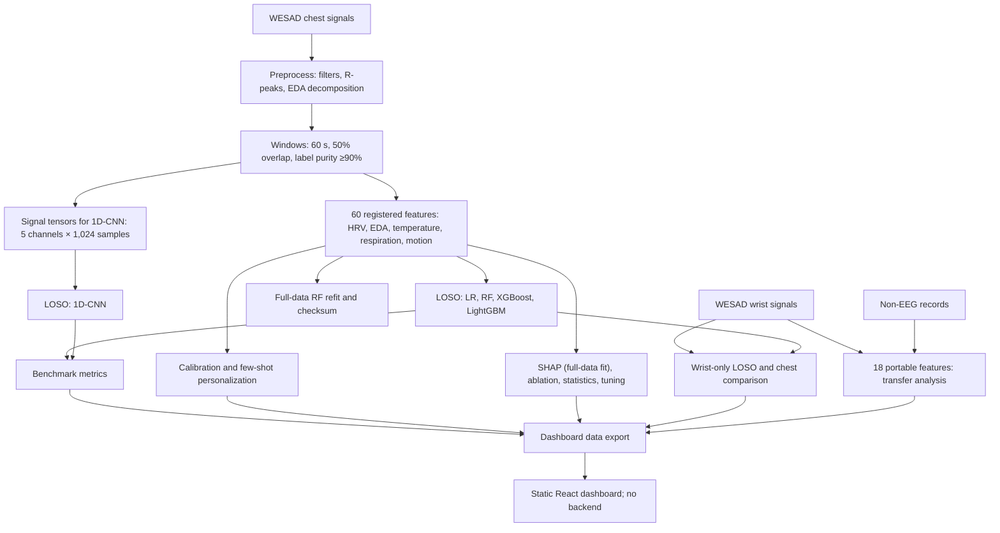
```mermaid
flowchart TD
    A["WESAD chest signals"] --> B["Preprocess: filters, R-peaks, EDA decomposition"]
    B --> C["Windows: 60 s, 50% overlap, label purity ≥90%"]
    C --> D["60 registered features: HRV, EDA, temperature, respiration, motion"]
    C --> R["Signal tensors for 1D-CNN: 5 channels × 1,024 samples"]
    D --> E["LOSO: LR, RF, XGBoost, LightGBM"]
    R --> N["LOSO: 1D-CNN"]
    E --> F["Benchmark metrics"]
    N --> F
    D --> G["Calibration and few-shot personalization"]
    D --> H["SHAP (full-data fit), ablation, statistics, tuning"]
    D --> I["Full-data RF refit and checksum"]
    W["WESAD wrist signals"] --> V["Wrist-only LOSO and chest comparison"]
    E --> V
    W --> P["18 portable features: transfer analysis"]
    O["Non-EEG records"] --> P
    F --> J["Dashboard data export"]
    G --> J
    H --> J
    V --> J
    P --> J
    J --> K["Static React dashboard; no backend"]
```

</details>

## Models

<details>
<summary>5 models · settings</summary>

| Model | Key settings |
| --- | --- |
| Logistic Regression | C=1.0, L2, class-balanced |
| Random Forest | 200 trees, depth 10, class-balanced |
| XGBoost | 200 trees, depth 7, learning rate 0.1 |
| LightGBM | 200 trees, 50 leaves, learning rate 0.1 |
| 1D-CNN | Residual blocks, AdamW, early stopping |

Feature models: fold-local imputation/scaling. CNN: raw windows.

</details>

## Features

**60 registered columns**; the saved benchmark retained **58**, excluding all-NaN
`RESP_inhale_exhale_ratio` and `RESP_variability`.

<details>
<summary>6 groups · counts and examples</summary>

| Group | Count | Examples |
| --- | ---: | --- |
| HRV time domain | 12 | MeanNN, SDNN, RMSSD, pNN50 |
| HRV frequency | 8 | LF/HF power, LF/HF ratio |
| HRV nonlinear | 10 | SampEn, DFA, SD1/SD2, CSI |
| EDA | 15 | SCL level, SCR count, SCR amplitude |
| Temperature + respiration | 10 | Temperature slope, respiration rate |
| Accelerometer | 5 | Magnitude mean, standard deviation, energy |

</details>

## Tech stack

**Models:** scikit-learn, XGBoost, LightGBM, PyTorch · **Signals:** NeuroKit2, SciPy · **Explainability:** SHAP.
**Dashboard:** React, TypeScript · **Checks:** GitHub Actions, Ruff, mypy, pytest.

## Limitations

1. **Cohort:** 15 WESAD lab subjects; wide confidence intervals and no clinical validation.
2. **Analysis:** 60 s windows limit VLF and long-term DFA estimates. CNN performance is weak; exploratory analyses lack multiplicity correction.
3. **Transfer:** One WESAD/Non-EEG pair; signal units, devices, stressors, and labels differ.

## Future work

1. Test transfer on a third dataset with matched sensors and stress labels.
2. Evaluate stress predictions during daily life outside the lab.
3. Build live wearable inference; measure prediction latency and battery use.

## Ethics & data use

1. Obtain informed consent before collecting physiological recordings.
2. Collect only required signals; omit names and direct identifiers.
3. Use predictions for research only; follow each dataset's terms.

## References

1. Schmidt et al. (2018). [Introducing WESAD, a Multimodal Dataset for Wearable Stress and Affect Detection](https://doi.org/10.1145/3242969.3242985). *ACM ICMI*, 400-408.
2. ESC/NASPE Task Force (1996). [Heart Rate Variability: Standards of Measurement, Physiological Interpretation, and Clinical Use](https://doi.org/10.1161/01.CIR.93.5.1043). *Circulation*, 93(5), 1043-1065.
3. Guo et al. (2017). [On Calibration of Modern Neural Networks](https://proceedings.mlr.press/v70/guo17a.html). *ICML*, PMLR 70, 1321-1330.
4. Vos et al. (2023). [Generalizable Machine Learning for Stress Monitoring from Wearable Devices: A Systematic Literature Review](https://doi.org/10.1016/j.ijmedinf.2023.105026). *International Journal of Medical Informatics*, 173, 105026.

## License

[MIT](LICENSE) · © 2025 Urme Bose · [Citation](CITATION.cff)

Use, modify, distribute, or sell; retain copyright and license notices.
Provided "AS IS", without warranty. Dataset and dependency terms apply separately.
